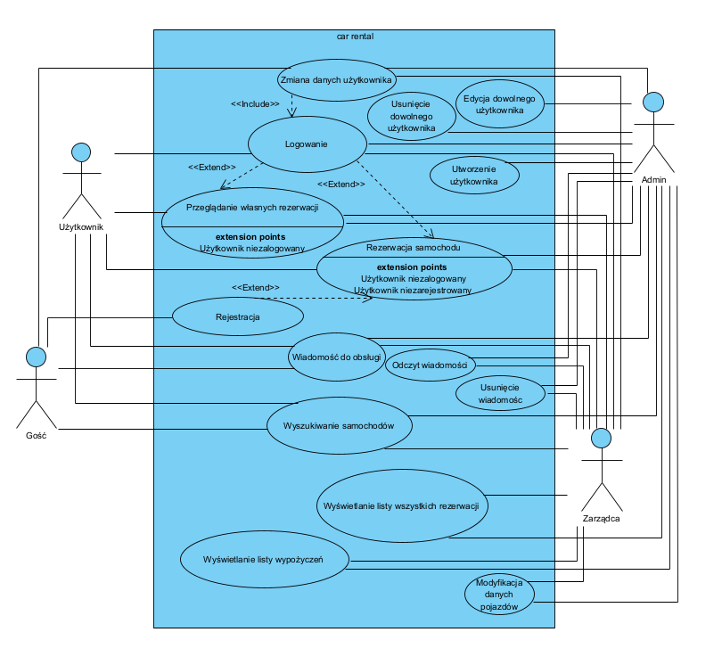

# 1. Cel projektu
Celem projektu jest zaprojektowanie oraz implementacja aplikacji webowej wspomagającej procesy obsługi zleceń związanych z wypożyczaniem samochodów osobowych dla klientów indywidualnych.
Po przez informatyzację wszystkich procesów obsługi klienta, aplikacja zapewni szereg korzyści m.in:
* redukcję kosztów obsługi zamówień po przez ich całkowitą automatyzację,
* zwiększenie wydajności obsługi klientów,
* zapewnienie bezpieczeństwa danych przechowywanych w scentralizowanej bazie danych.

# 2. Szczegółlowy opis wymagań
## 2.1. Wymagania funkcjonalne
System umożliwia:
* wyszukiwanie dostępnych w określonym terminie samochodów, wg zadanych kryteriów takich jak:
    * typ pojazdu, 
    * marka,
    * kolor,
    * rodzaj paliwa,
    * pojemność silnika,
    * rodzaj skrzyni biegów,
* wyświetlenie szczegółowych informacji na temat wybranego pojazdu,
* rejestrację użytkowników,
* przeglądanie pojazdów w tynie gościa,
* dokonanie rezerwacji przez zarejestrowanego i zalogowanego użytkownika,
* odwołanie rezerwacji przez osobę zarządzającą,
* rejestrację użytkowników oraz modyfikację danych przez użytkowników,
* przeglądanie własnych rezerwacji,
* dodawanie/usuwanie oraz modyfikacje pojazdów przez osobę zarządzającą,
* przeglądanie listy zarezerwowanych oraz wypożyczonych samochodów przez osobę zarządzającą,
* obsługę płatności,
* generowanie i pobieranie faktur elektronicznych w formacie pdf
* kontaktowanie się z obsługą wypożyczalni po przez formularz kontaktowy.

# 2.2. Wymaganie niefunkcjonalne
* GUI:
    * Aplikacja webowa z interfejsem dla przeglądarki internetowej
    * Spójny wygląd zgodnie z zaakceptowanym szablonem (spójna kolorystyka, menu, zachowanie się systemu)
* Dostępność:
    * Obsługa języków: polski
    * Obsługa przeglądarek: Chrome, Safari, Edge
* Niezawodność:
    * System dostępny 24/7. MTFB = 1000h.
* Bezpieczeństwo
    * haszowanie haseł
    * automatyczne wylogowanie użytkownika po upływie 10 minut
    * spełnia wymagania Ustawy z dnia 10 maja 2018 r. o
      ochronie danych osobowych (RODO)

# 2.3. Ograniczenia
* System musi być inslowany z obrazu Dockera pobieranego online
* Aplikacja zbudowana w oparciu o architekturę monolityczną we frameworku Spring Boot oraz wzorzez MVC
* System musi być zgodny z ustawą o ochdonie danych osobowych RODO

# 3. Użytkownicy (Role)
1. Administrator (super user)
  - posiada uprawnienia wszystkich użytkowników, a ponadto ma możliwość zarządzania użytkownikami oraz przypisywania użytkownikom okreslonej roli
2. Zarządzający
  - posiada uprawnienia użytkownika oraz gościa a ponadto:
    - posiada możliwość przeglądania wszystkich rezerwacji
    - posiada możlwiwość anulowania dowolnej rezerwacji
    - posiada możliwość modyfikacji dowolnej rezerwacji
3. Użytkownik
  - posiada uprawnienia gościa, a ponadto:
    - posiada możliwość dokonywania rezerwacji
    - posiada możliwość opłacania rezerwacji
    - posiada możliwość przeglądania swoich rezerwacji
    - posiada możliwość generowania faktur
4. Gość
  - posiada możliwość wyszykiwania pojazdów w wybranym terminie, spełniających wybrane kryteria.

4. Słownik pojęć

* **MTFB (Mean Time between Failures)** - średni czas pomiędzy wystąpieniem awarii
* **Docker** - otwarte oprogramowanie do wirtualizacji, umożliwiające "konteneryzację" tj. pozwalające umieścić program oraz jego zależności (biblioteki) w przenośnym wirtualnym kontenerze który można uruchomić na dowolnym serwerze z systemem Linux, Windows i MacOS.
* **GUI (Graphical User Interface)** - graficzny interfejs użytkownika
* **RODO** - Ogólne rozporządzenie o ochronie danych, inaczej rozporządzenie o ochronie danych osobowych, OROD lub RODO – rozporządzenie unijne, zawierające przepisy o ochronie osób fizycznych w związku z przetwarzaniem danych osobowych oraz przepisy o swobodnym przepływie danych osobowych
* **PDF (PDF Portable Document Format)** - format plików służący do prezentacji, przenoszenia i drukowania treści tekstowo-graficznych, stworzony przez firmę Adobe Systems. Obecnie rozwijany i utrzymywany przez Międzynarodową Organizację Normalizacyjną. 

5. Diagram przypadków użycia

.

6. Scenariusze przypadków użycia
