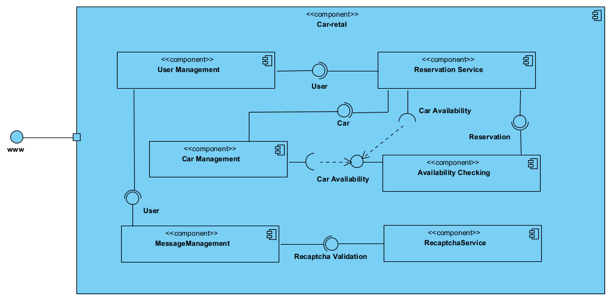

# 1. Cel projektu
Celem projektu jest zaprojektowanie oraz implementacja aplikacji webowej wspomagającej procesy obsługi zleceń związanych z wypożyczaniem samochodów osobowych dla klientów indywidualnych.
Po przez informatyzację wszystkich procesów obsługi klienta aplikacja zapewni szereg korzyści m.in.:
* redukcję kosztów obsługi zamówień po przez ich całkowitą automatyzację,
* zwiększenie wydajności obsługi klientów,
* zapewnienie bezpieczeństwa danych przechowywanych w scentralizowanej bazie danych.

# 2. Słownik pojęć

* **MTFB (Mean Time between Failures)** - średni czas pomiędzy wystąpieniem awarii
* **Docker** - otwarte oprogramowanie do wirtualizacji, umożliwiające "konteneryzację" tj. pozwalające umieścić program oraz jego zależności (biblioteki) w przenośnym wirtualnym kontenerze który można uruchomić na dowolnym serwerze z systemem Linux, Windows i MacOS.
* **GUI (Graphical User Interface)** - graficzny interfejs .
* **RODO** - Ogólne rozporządzenie o ochronie danych, inaczej rozporządzenie o ochronie danych osobowych, OROD lub RODO – rozporządzenie unijne, zawierające przepisy o ochronie osób fizycznych w związku z przetwarzaniem danych osobowych oraz przepisy o swobodnym przepływie danych osobowych.
* **PDF (PDF Portable Document Format)** - format plików służący do prezentacji, przenoszenia i drukowania treści tekstowo-graficznych, stworzony przez firmę Adobe Systems. Obecnie rozwijany i utrzymywany przez Międzynarodową Organizację Normalizacyjną.
* **Spring Boot** - framework do budowania aplikacji w tym aplikacji webowych w języku java.
* **Thymeleaf** - silnik szablonów html.
* **H2** - baza danych SQL przechowująca dane w pliku lub w pamięci operacyjnej, stosowana do testów lub prostych aplikacji w tym MVP.

# 3. Szczegółowy opis wymagań
## 3.1. Wymagania funkcjonalne
System umożliwia:
* wyszukiwanie dostępnych w określonym terminie samochodów, wg zadanych kryteriów takich jak:
    * marka,
    * model
* wyświetlenie szczegółowych informacji na temat wybranego pojazdu,
* rejestrację użytkowników,
* logowanie użytkowników
* zarządzanie użytkownikami w trybie administratora (dodawanie/edycja/usuwanie)
* przeglądanie pojazdów w trybie gościa,
* dokonanie rezerwacji przez zarejestrowanego i zalogowanego użytkownika,
* odwołanie rezerwacji przez osobę zarządzającą,
* rejestrację użytkowników oraz modyfikację danych przez użytkowników,
* przeglądanie własnych rezerwacji,
* dodawanie/usuwanie oraz modyfikacje pojazdów przez osobę zarządzającą,
* przeglądanie listy zarezerwowanych oraz wypożyczonych samochodów przez osobę zarządzającą,
* obsługę płatności,
* generowanie i pobieranie potwierdzenia rezerwacji w formacie pdf
* kontaktowanie się z obsługą wypożyczalni po przez formularz kontaktowy
* wysyłanie wiadomości do obsługi serwisu
* wysyłanie wiadomości do obsługi w trybie gościa zabezpieczone reCaptcha v2
* walidacja dla wszystkich wprowadzonych pól wraz z systemem alertów/ostrzeżeń o źle wprowadzonych danych (pola o szczególnej składni jak kod pocztowy czy email walidowane z wykorzystaniem wyrażeń regularnych)
* zabezpieczenie ścieżek URL (dostęp do ściezki tylko dla użytkowników uprawnionych)

## 3.2. Opcjonalne wymagania funkcjonalne
* rozszerzenie wyszukiwania dostępnych samochodów o kryteria takie jak:
    * rodzaj skrzyni biegów
    * rodzaj silnika (benzyna/diesel/elektryczny)
* zmiana statusu z rezerwacji na wypożyczenie
* generowanie faktur dla rezerwacji
* generowanie korekty faktury w przypadku odwołania zlecenia

## 3.3. Wymaganie niefunkcjonalne
* GUI:
    * Aplikacja webowa z interfejsem dla przeglądarki internetowej
    * Spójny wygląd zgodnie z zaakceptowanym szablonem (spójna kolorystyka, menu, zachowanie się systemu)
* Dostępność:
    * Obsługa języków: polski
    * Obsługa przeglądarek: Chrome, Safari, Edge
* Niezawodność:
    * System dostępny 24/7. MTFB = 1000h.
* Bezpieczeństwo
    * haszowanie haseł
    * automatyczne wylogowanie użytkownika po upływie 10 minut
    * spełnia wymagania Ustawy z dnia 10 maja 2018 r. o
      ochronie danych osobowych (RODO)
* Tabele danych do wyświetlenia, w szczególności dla danych filtrowanych łaodwane bez przeładowywania całej strony. Architektura typu Single Page Application nie jest wymagana, dopuszczalna jest architektura hybrydowa.

## 3.4. Ograniczenia
* System musi być instalowany z obrazu Dockera pobieranego online
* System musi być zgodny z ustawą o ochronie danych osobowych RODO
* System musi obsługiwać przeglądarki Chrome i Edge
* MVC zbudowane na podstawie plikową bazę danych zintegrowaną z aplikacją, aby wyeliminować konieczność tworzenia osobnej bazy danych.

## 3.5. Architektura aplikacji

### 3.5.1.
Aplikacja wykorzystywać będzie wzorzec projektowy MVC. Zgodnie ze wzorcem MVC będzie podzielona na 3 moduły:
* Model reprezentujący dane (np. pobierane z bazy danych czy parsowane z plików XML)
* Widok reprezentujący interfejs użytkownika 
* Kontroler, czyli logikę sterującą aplikacją
Logika sterująca kontrolera, ze względu na poprawienie czytelności kodu, będzie rozdzielona na kontroler, który będzie odpowiedzialny za obsługę zapytań zewnętrznych,
oraz serwis odpowiedzialny za realizację logiki biznesowej, oraz będący łącznikiem z warstwą modelu, zapewniającą dostęp do bazy danych. Taki podział będzie dotyczył się każdego z poszczególnych widoków aplikacji.

### 3.5.2. Aplikacja monolityczna / hybrydowa
Aplikacja zostanie zbudowana jako aplikacja monolityczna z możliwością rozbudowy do aplikacji hybrydowej po przez możliwość obsługi dodatkowych serwisów/mikroserwisów.

### 3.5.3. Architektura warstwy frontendowej
Frontend aplikacji zostanie stworzony z wykorzystaniem silnika szablonów Thymeleaf wspieranego przez Spring Boot. 
Oprócz statycznych szablonów warstwa frontend będzie wyposażona w dynamiczne elementy obsługiwane za pomocą JavaScript (AJAX), które zostaną wykorzystane m.in. do budowania dynamicznych tablic
pozwalających wspierających mechanizm wyszukiwania (filtrowania rekordów).


# 4. Użytkownicy (Aktorzy/Role)
1. Administrator (super user)
- posiada uprawnienia wszystkich użytkowników, a ponadto ma możliwość zarządzania użytkownikami oraz przypisywania użytkownikom okreslonej roli
2. Zarządzający
- posiada uprawnienia użytkownika oraz gościa a ponadto:
  - posiada możliwość przeglądania wszystkich rezerwacji
  - posiada możliwość anulowania dowolnej rezerwacji
  - posiada możliwość modyfikacji dowolnej rezerwacji
3. Użytkownik
- posiada uprawnienia gościa, a ponadto:
  - posiada możliwość dokonywania rezerwacji
  - posiada możliwość opłacania rezerwacji
  - posiada możliwość przeglądania swoich rezerwacji
  - posiada możliwość generowania faktur
4. Gość
- posiada możliwość wyszukiwania pojazdów w wybranym terminie, spełniających wybrane kryteria.

# 5. Diagramy przypadków użycia (wybrane przykłady)
.

# 6. Scenariusze przypadków użycia
Poniżej przedstawiono wybrane scenariusze przypadków użycia spośród wszystkich scenariuszy:
- logowanie do systemu
- rejestracja użytkownika
- wysłanie wiadomości do obsługi
- odczyt wiadomości przez administratora/managera
- usuwanie wiadomości przez administratora/managera
- wyszukiwanie samochodów
- rezerwacja samochodu
- wyświetlanie listy wszystkich rezerwacji przez administratora/managera
- przeglądanie własnych rezerwacji przez użytkownika
- zmiana danych własnych użytkownika
- tworzenie użytkownika przez administora
- edycja dowolnego użytkownika przez administratora
- usuwanie dowolnego użytkownika przez administratora
- wyświetlanie listy wypożyczeń
## 6.1. Logowanie do systemu
.
## 6.1. Zmiana danych
.
## 6.1. Rezerwacja samochodu
.

# 7. Model bady danych
## 7.1. Model konceptualny


## 7.2. Model logiczny (ERD)


# 7.3. Model relacyjny (Fizyczny)


# 7. Diagramy czynności (wybrane przykłady)
Poniżej przedstawiono wybrane diagramy czynności. Wszystkie diagramy znajdują się na poniższej liście:
- logowanie do systemu
- rejestracja użytkownika
- wysłanie wiadomości do obsługi
- odczyt wiadomości przez administratora/managera
- usuwanie wiadomości przez administratora/managera
- wyszukiwanie samochodów
- rezerwacja samochodu
- wyświetlanie listy wszystkich rezerwacji przez administratora/managera
- przeglądanie własnych rezerwacji przez użytkownika
- zmiana danych własnych użytkownika
- tworzenie użytkownika przez administora
- edycja dowolnego użytkownika przez administratora
- usuwanie dowolnego użytkownika przez administratora
- wyświetlanie listy wypożyczeń

## 7.1. Logowanie do systemu


## 7.2. Zmień dane użytkownika


## 7.3. Zmiana danych pojazdu


## 7.4 Wyszukiwanie samochodów


## 7.5. Rejestracja użytkownika


# 8. Diagramy sekwencji (wybrane przykłady)
Poniżej przedstawiono wybrane diagramy sekwencji. Wszystkie diagramy znajdują się na poniższej liście:
- logowanie do systemu
- rejestracja użytkownika
- wysłanie wiadomości do obsługi
- odczyt wiadomości przez administratora/managera
- usuwanie wiadomości przez administratora/managera
- wyszukiwanie samochodów
- rezerwacja samochodu
- wyświetlanie listy wszystkich rezerwacji przez administratora/managera
- przeglądanie własnych rezerwacji przez użytkownika
- zmiana danych własnych użytkownika
- tworzenie użytkownika przez administora
- edycja dowolnego użytkownika przez administratora
- usuwanie dowolnego użytkownika przez administratora
- wyświetlanie listy wypożyczeń

## 8.1. Logowanie do systemu


## 8.2. Wyświetlanie listy wszystkich rezerwacji użytkownika


## 8.3. Wyświetlanie listy dostępnych samochodów spełniających wybrane kryteria


# 9. Diagramy stanów (wybrane przykłady)
## 9.1. Zarządzanie użytkownikami

## 9.2. Status/rola zalogowanego użytkownika

## 9.3. Zarządzanie wiadomościami


# 10. Diagram klas


# 11. Kod SQL
## 11.1. Standard tworzenia bazy danych
Struktura bazy danych budowana jest z wykorzystaniem narzędzia Flyway (https://flywaydb.org/), które odpowiada również za wypełnienie bazy danych danymi testowymi.
Z uwagi na fakt, że aplikacja testowa nie posiada wszystkich projektowanych funkcji, również baza danych nie zawiera wszystkich tabel określonych na diagramie ERD.
Poniżej zamieszczono kod SQL do wszystkich tabel, z których aktualnie korzysta aplikacja. Wszystkie tablice dostępne są również w folderze aplikacji:
https://github.com/lukaszse/car-rental/tree/master/src/main/resources/db/migration

## 11.2. Dialekt SQL
W projekcie wykorzystano bazę danych H2 oraz dialekt SQL H2 (https://www.h2database.com/).

## 11.3. Kod SQL

### 11.3.1. Tabela CAR
```sql
create table car (
                     id int primary key auto_increment,
                     registration_no varchar(255),
                     manufacturer varchar(255) not null,
                     model varchar(255) not null ,
                     fuel_type varchar(255) not null ,
                     type varchar(255) not null ,
                     engine_capacity int not null ,
                     passenger_number int not null ,
                     description varchar(255) not null,
                     cost_per_day numeric(19,2) not null
);
```

## 11.3.2. Tabela APP_USER
```sql
create table app_user (
    user_name  varchar(40) primary key,
    first_name varchar(255),
    last_name varchar(255),
    user_role varchar(255),
    password varchar(500)
);
```

## 11.3.3. Tabela RESERVATION
```sql
create table reservation (
    id int primary key auto_increment,
    user_name varchar(255) not null,
    car_id int not null,
    reservation_date date,
    date_from date,
    date_to date,
    total_cost numeric(19,2) not null,
    invoice_id varchar(255),
    rented bit,
    foreign key (car_id) references car(id),
    foreign key (user_name) references app_user(user_name)
);
```

## 11.3.4. Tabela MESSAGE
```sql
create table message (
    id int primary key auto_increment,
    user_name varchar(40),
    subject varchar(255),
    content varchar(1000),
    sent_date date,
    is_read bit
);
```

# 12. System kontroli wersji oraz repozytorium

## 12.1. Wymagania wstępne
Aby skorzystać z repozytorium, należy na lokalnej maszynie zainstalować aplikację Git do kontroli wersji.
Aplikacja jest dostępna dla systemów Windows, Linux oraz MacOS:
https://git-scm.com/

## 12.2. Pobieranie repozytorium
Kod źródłowy aplikacji Car-Rental znajduje się w repozytrium w serwisie GitHub:
https://github.com/lukaszse/car-rental

W celu pobrania repozytorium użyj komendy:

`git clone https://github.com/lukaszse/car-rental.git`

## 12.3. Uruchamianie aplikacji
Aby uruchomić aplikację, należy zbudować plik jar. W tym celu należy użyć komendy:

`./mvnw clean install`

## 12.4. Konfiguracja
W aplikacji skonfigurowano dwa profile **LOCAL** służący do uruchamiania aplikacji na lokalnym komuterze (z rozszerzonymi opcjami logowania, debbugowania oraz dostępem bez szyfrowania TSL) oraz **PROD** służący do uruchomienia aplikacji produkcyjnej na serwerze.
Profil można przełączyć poprzez modufykację zmiennej `spring.profiles.active=prod`, która znajduję się w pliku `src/main/resources/application.properties`.
Szczegółowe konfiguracje dla środowisk znajdują się w plikach `application-local.yml` oraz application-prod.yml` znajdujących się w tej samej lokalizacji.

# 13. Obraz Docker
W głównym folderze aplikacji znajduje się plik `Dockerfile`, który służy do zbudowania obrazu z aktualnego pliku jar znajdującego się w folderze `target`.
Aby zbudować obraz name użyć komendy:

`docker build -t nazwaObrazu .`

W celu zapisania obrazu w repozytorium zdalnym Docker'a (tak, aby był dostępny on online dla publicznie), należy użyć komendy:
`docker push nazwaObrazu`

# 14. Implementacja
## 14.1. Zastosowane technologie i wymahgania wobec developera
Aplikację napisano w języku Java w wersji 17 oraz z wykorzystaniem frameworku Spring Boot. W aplikacji wykorzystano także mechanizm szablonów Thymeleaf oraz elementy napisane w języku JavaScript.
Podstawowa znajomość wszystkich tych technologii jest konieczna do rozpoczęcia pracy z kodem aplikacji.

## 14.2. Wykorzystane algorytmy

### 14.2.1. Algorytm sprawdzania dostępności samochodu w danym przedziale czasu

W aplikacji zastosowano mechanizm sprawdzania dostępności samochodu w danym przedziale czasu.
Algorytm ten wykorzystywany jest w dwóch sytuacjach:
1. Wyszukiwanie samochodów w widoku **cars** - użytkownik ma możliwość wpisania zakresu czasu (`dateFrom` oraz `dateTo`),w celu wyszukiwania dostępnych do wypożyczenia samochodów. Mechanizm ten realizowany jest z wykorzystaniem zapytania REST API **@GET**, które zaimplementowane zostało z wykorzystaniem Javascript (AJAX).
   Do obsługi zapytania **@GET** utworzono endpoint `cars/findCars`, który przyjmuje m.in. dwa parametry QueryParam - `dateFrom` oraz `dateTo`.


3. Rezerwowanie samochodu (dodawanie rezerwacji) - po wyszukaniu samochodu użytkownik w widoku **cars** ma możliwość zarezerwowania wybranego samochodu przez kliknięcie przycisku **Book**, a następnie poprzez potwierdzenie zamówienia przez kliknięcie przycisku **Submit** na ekranie z danymi samochodu, co spowoduje wysłanie zapytania **@POST** oraz wywołanie metody 'performAddReservation' która przyjmuje kilka paramerów, w tym parametry `dateFrom` oraz `dateTo`.
   Przed zarezerwowaniem samochodu również sprawdzana jest dostępność samochodu, a operacja przeprowadzana jest w formie transakcji.


Obie wyżej wymienione metody korzystają z klasy `AvailabilityService` oraz zaimplementowanego w niej algorytmu:

```java
    public boolean isCarAvailable(final Integer carId, final TimePeriod timePeriod) {
        if(timePeriod.getDateFrom() == null && timePeriod.getDateTo() == null) {
            return true;
        }
        return reservationSearchRepository.findByCar_Id(carId).stream()
                .map(reservation -> TimePeriod.of(reservation.getDateFrom(), reservation.getDateTo()))
                .noneMatch(reservationPeriod -> checkIfPeriodOverlap(timePeriod, reservationPeriod));
    }

    private static boolean checkIfPeriodOverlap(final TimePeriod timePeriod1, TimePeriod timePeriod2) {
        final LocalDate s1 = timePeriod1.getDateFrom();
        final LocalDate e1 = timePeriod1.getDateTo();
        final LocalDate s2 = timePeriod2.getDateFrom();
        final LocalDate e2 = timePeriod2.getDateTo();

        if(s1 == null || e1 == null || s2 == null || e2 == null) {
            return false;
        }

        if(s1.compareTo(s2)<=0 && e1.compareTo(s2)>=0 ||
                s1.compareTo(e2)<0 && e1.compareTo(e2)>0 ||
                s1.compareTo(s2)<0 && e1.compareTo(e2)>0 ||
                s1.compareTo(s2)>0 && e1.compareTo(e2)<0 )
        {
            log.info("Periods overlap! Period 1: {}, Period2: {}", timePeriod1, timePeriod2);
            return true;
        }
        else {
            return false;
        }
    }
```

Jak widać (co wynika z powyższego kodu) metoda `isCarAvailable` wywołuje zapytanie bazy danych z wykorzystaniem `RepositorySearchService` w celu pobrania wszystkich rezerwacji dla danego samochodu, a następnie sprawdza, czy jakikolwiek okres z pobranych rezerwacji nie pokrywa się z okresem rezerwacji wymaganym przez użytkownika.
Jeśli żaden z tych okresów się nie pokrywa `noneMatch` metoda zwraca `true`, w przeciwnym razie `false`.
Samo sprawdzenie, czy pojedynczy pobrany z bazy danych okres rezerwacji pokrywa się z okresem rezerwacji wymaganym przez użytkownika sprawdzane jest w metodzie 'checkIfPeriodOverlap'.
Niniejszy algorytm przedstawiono na poniższych schematach blokowych (zastosowano osobny schemat dla metody `checkIfPeriodsOverlap`):


# 15. Testowanie
Podstawową formą testów aplikacji będą testy jednostkowe oraz
integracyjne pisane na bieżąco, w trakcie powstawania kodu źródłowego, pisane
przez zespół testerski.
Co więcej, w uzgodnieniu z użytkownikami aplikacji przygotowane zostanie
około 20 różnych przypadków testowych. Testy realizować będzie zespół testerów.
W tym celu utworzone zostanie środowisko testowe, na którym zostanie
uruchomiona pełna funkcjonalność aplikacji. Przypadki testowe będą zawierały m.in. przypadki dodawania nowych samochodów, dodawania użytkowników,
rezerwacji samochodów itd.
Dodatkowo zostaną przeprowadzone testy wydajnościowe aplikacji dla
określonej grupy wirtualnych użytkowników.
## 15.1. Testy jednostkowe
W aplikacji wykorzystano testowy framework Spock oraz testy jednostkowe napisane w języku Groovy.
Spock umożliwia między innymi tworzenie testów wykorzystujących koncepcję Data Driven Tests.

15.1. Testowanie metody sprawdzającej dostępność samochodów
Jak to opisano w punkcie 14.2.1. w aplikacji zastosowano algorytm sprawdzania dostępności pojazdów, który znajduje się w klasie `AvailabilityService`.
Algorytm ten wykorzystuje metodę `checkIfPeriodsOverlap`, która sprawdza, czy dwa okresy się pokrywają (okres 'TimePeriod' jest obiektem zawierającym dwie daty
- datę "od" oraz datę "do").
Poniżej zamieszczono kod testu jednostkowego sprawdzającego poprawność działania metody `checkIfPeriodsOverlap`:
```groovy
    @Unroll
    def "should check if data ranges overlap correctly - test #no"() {

        when: "invoke method to check if data ranges overlaps"
        def overlap = availabilityService.checkIfPeriodsOverlap(firstPeriod, secondPeriod)

        then: "should check correctly if data ranges overlap"
        overlap == expectedResult

        where:
        no | firstPeriod           | secondPeriod          || expectedResult
        1  | getTimePeriod(1, 2)   | getTimePeriod(3, 4)   || false
        2  | getTimePeriod(2, 4)   | getTimePeriod(3, 5)   || true
        3  | getTimePeriod(1, 4)   | getTimePeriod(20, 30) || false
        4  | getTimePeriod(10, 14) | getTimePeriod(7, 13)  || true
        5  | getTimePeriod(10, 14) | getTimePeriod(7, 60)  || true
        7  | getTimePeriod(1, 200) | getTimePeriod(7, 60)  || true
        8  | getTimePeriod(1, 3)   | getTimePeriod(1, 3)   || true
        9  | getTimePeriod(5, 8)   | getTimePeriod(1, 3)   || false
    }

    static def getTimePeriod(final int plusDaysFrom, final int plusDaysTo) {
        TimePeriod.of(LocalDate.now().plusDays(plusDaysFrom), LocalDate.now().plusDays(plusDaysTo))
    }
```
Aby uruchomić test, konieczne było utworzenie protez ("mocks") dla wykorzystanych obiektów:
```groovy
    ReservationSearchRepository repository = Mock()
    AvailabilityService availabilityService = new AvailabilityService(repository)
```
Odnośnik do klasy testowej: https://github.com/lukaszse/car-rental/blob/master/src/test/groovy/org/lukaszse/carRental/service/AvailabilityServiceSpec.groovy

15.2. Walidacja daty
W aplikacji wykorzystano mechanizm adnotacji do walidowania m.in. danych przychodzących z zewnątrz (z przeglądarki internetowej do serwera).
Stworzono, także m.in. niestandardową adnotację `@ValidateTimePeriod` oraz walidator do sprawdzania poprawności wprowadzanych dat.
Walidator stanowi odrębną klasę, z główną metodą `isValid`, która używa odpowiedniej logiki do zweryfikowania poprawności wprowadzonego okresu (TimePeriod).
Walidator sprawdza m.in. czy nie wprowadzono daty z przeszłości oraz, czy data "do" nie jest wcześniejsza niż data "do".
W celu sprawdzenia poprawności działania walidatora przygotowano test jednostkowy weryfikujący poprawność działania metody `isValid`:

```groovy
    def "should validate TimePeriod correctly"() {

        expect: 'should return correct validation result'
        timePeriodValidator.isValid(timeperiod, constraintValidatorContext) == expectedResult

        where:
        timeperiod                                                                || expectedResult
        TimePeriod.of(LocalDate.now().plusDays(2), LocalDate.now().plusDays(3))   || true
        TimePeriod.of(LocalDate.now().plusDays(5), LocalDate.now().plusDays(3))   || false
        TimePeriod.of(LocalDate.now().minusDays(5), LocalDate.now().plusDays(3))  || false
        TimePeriod.of(LocalDate.now().minusDays(5), LocalDate.now().minusDays(3)) || false
        TimePeriod.of(LocalDate.now().plusDays(3), LocalDate.now().plusDays(3))   || true
    }
```

Metoda testowa wykorzystuje protezy obiektów ("mocks"):
```groovy
    TimePeriodValidator timePeriodValidator = new TimePeriodValidator();
    ConstraintValidatorContext constraintValidatorContext = Mock()
```

# 15.2 Przypadki testowe dla testów manualnych

### 15.2.1. Logowanie do aplikacji
**Cel:** Sprawdzenie możliwości zalogowania dla użytkowników o różnych uprawnieniach

**Warunki początkowe** 
- W aplikacji istnieją aktywne konta użytkowników dla każdej roli tj. użytkownika, administratora i managera.
- Użytkownik znajduje się na ekranie powitalnym aplikacji

| Krok                           | Rezultat                       |
|--------------------------------|--------------------------------|
| 1. Kliknij na `Sign In` (menu) | 1. Wyświetlono ekran logowania |
| 2. Wprowadź login i hasło      | 2. Uzupełniono pola formularza |
| 3. Naciśnij przycisk zaloguj   | 3. Zalogowano do systemu       |

**Priorytet:** wysoki  
**Wykonanie** manualne  
**Szacowany czas:** 1 min. dla każdego logowania  
**Uwagi:** powtórzyć dla każdej roli [user, manager, admin]

### 15.2.2. Wyszykiwanie samochodu
**Cel:** Sprawdzenie możliwości wyszukania samochodu

**Warunki początkowe**
- Użytkownik zalogowany w systemie [user, manager, admin]
- W bazie danych znajduje się dostępne samochody (utworzone automatycznie dla celów testowych)
- Przed rozpoczęciem testu sprawdzić w bazie danych samochody dostępne dla wybranego okresu

| Krok                                                         | Rezultat                                                                     |
|--------------------------------------------------------------|------------------------------------------------------------------------------|
| 1. Kliknij na `Cars` (menu)                                  | 1. Wyświetlono z dostepnymi samochodami                                      |
| 2. Wprowadź wybrany okres (dateFrom i dateTo)                | 2. Wyświetlono samochody dostępne w danym okresie                            |
| 3. Wprowadź pierwsze znaki marki samochodu i naciśnij enter  | 3. Wyświetlono samochody których marka rozpoczyna się od wprowadzonych liter |
| 4. Wprowadź pierwsze znaki modelu samochodu i naciśnij enter | 4. Wyświetlono samochody których model rozpoczyna się od wprowadzonych liter |
| 5. Klinij przycisk `View Details` dla wybranego samochodu    | 5. Wyświetlono szczegóły samochodu                                           |


**Priorytet:** wysoki  
**Wykonanie** manualne  
**Szacowany czas:** 1 min dla każdej roli + 2 minuty na sprawdzenie danych w bazie.
**Uwagi:** powtórzyć dla każdej roli [user, manager, admin]

# 16. Diagramy komponentów
## 16.1. Diagram główynych komponentów systemu

Powyższy diagram komponentów przedstawia główne komponenty systemu z wyłączeniem bazy danych.

# 17. Wdrożenie
## 17.1. Diagramy wdrożenia
### 17.1.1. Wdrożenie z wykorzysaniem kontenera Docker


## 17.2. Wymagania systemowe
Aplikacja napisana została w wielopratformowym języku Java. Działa na każdym systemie z systemem operacyjnym Windows, Linux czy MacOS.
Poniżej przedstawiono szczegółowe wymagania systemowe.

Wymagania systemowe:
* System operacyjny Windows 10/11, MacOs, Linux oraz inne systemy z rodziny Unix.
* Zainstalowana maszyna wirtualna Javy w wersji minimum 17. Zalecana dystrybucja OpenJDK 17.
* Opcjonalnie zainstalowane oprogramowanie Docker. Zalecana wersja 20.10.10 lub wyższa.

## 17.3. Instalacja z wykorzystaniem pliku jar
Skopiowac plik na serwer oraz uruchomić komendę:

`java -jar nazwa_pliku.jar`

## 17.4. Instalacja z wykorzystaniem obrazu Docker
Aby ściągnąć obraz Dockera zawierający aplikację, należy użyć kolejno komend:

`docker pull llseremak/car-rental`
aby pobrać obraz, a następnie:

`docker run -d --restart unless-stopped -p 443:443 llseremak/car-rental`

gdzie pierwszy port 443 to port, pod którym aplikacja będzie dostępna z zewnątrz kontenera (port 443 jest portem domyślnym da połączeń szyfrowanych z wykorzystaniem TSL)

## 17.5. Dodatkowa konfiguracja z wykorzystaniem NGINX
Przy pomocy NGINX można skonfigurować przekierowanie z portu, na którym działa aplikacja do określonego adresu url.
Dokumentacja NGINX: http://nginx.org/en/docs/

## 17.5. Bezpieczeństwo i certyfikat HTTPS
W wersji MVC aplikacji wykorzystano niezarejestrowany certyfikat HTTPS. Gwarantuje on szyfrowanie danych przesyłanych z przeglądarki do serwera, jednak nie jest to certyfikat wydany przez Urząd Certyfikacji, wobec czego nie będzie traktowany przez przeglądarkę jako certyfikat zaufany.

# 18. Podręcznik użytkownika

**Spis treści**
1. Rejestrowanie użytkownika
2. Logowanie do systemu
3. Wyszukiwanie dostępnych pojazdów
4. Składanie rezerwacji
5. Przeglądanie rezerwacji oraz usuwanie rezerwacji
6. Wysyłanie wiadomości
7. Funkcje dostępne dla managera
   1. edycja pojazdów 
   2. usuwanie pojazdów 
   3. przegadanie rezerwacji wszystkich użytkowników 
   4. edycja rezerwacji 
   5. usuwanie rezerwacji 
   6. odczytywanie wiadomości
8. Funkcje dostępne dla administratora
   1. zarządzanie użytkownikami 
   2. ustawienia administracyjne

## 18.1. Logowanie do systemu

W celu zalogowania się do aplikacji najpierw otworzyć stronę serwisu:
https://ubuntu.llseremak.p3.tiktalik.io/car-rental/
W celu zalogowania się do systemu należy, wpisać prawidłowy login oraz hasło. 

W przypadku wpisania błędnych danych użytkownik nie zostanie zalogowany, a na ekranie zostanie wyświetlony stosowny komunikat.


**Uwaga**: W wersji prezentacyjnej (MVC) wykorzystano darmowy certyfikat SSL, który zapewnia pełne szyfrowanie ruchu pomiędzy przeglądarką
użytkownika a serwerem, jednak nie jest to certyfikat autoryzowany przez Urząd Certyfikacji, wobec tego nie będzie rozpoznany przez przeglądarki jako
certyfikat zaufany. Wymagać to może, odpowiednich kroków w zależności od konkretnej przeglądarki. W większości przypadków konieczne będzie wybranie opcji zaawansowanych[1], w celu wyświetlenia możliwości otwarcia strony[2].


**Uwaga**: W wersji prezentacyjnej (MVC) na ekranie logowania znajdują się informację o danych do logowania do kont dla wszystkich
typów użytkowników.

## 18.2. Wyszukiwanie samochodów
Aby wyświetlić ekran wyszukiwania samochodów, należy kliknąć zakładkę `Cars` w górnym menu [1].
Wstępnie zostaną wyświetlone wszystkie samochody. Aby wyszukać samochód dostępny w danym terminie, należy wprowadzić dwie daty `dateFrom` oraz `dateTo` [2].
Po wpisaniu dat wyświetlone zostaną wszystkie samochody dostępne w danym terminie. Aby zawęzić wyszukiwania można użyć dodatkowych filtrów [3] w celu wprowadzenia marki oraz modelu samochodu.
Na ekranie wyświetlane jest pierwsze 5 znalezionych pojazdów, aby wyświetlić pozostałe wyniki, należy przejść do kolejnych stron wyszukiwania, w tym celu należy kliknąć 
numer strony znajdujący się pod wynikami wyszukiwania.


**Uwaga:** W wersji prezentacyjnej (MVP) aplikacji nie zaimplementowano sortowania ani możliwości wyboru ilości stron do wyświetlenia na ekranie logowania. Funkcje te znajdą się w pełnej wersji aplikacji.
