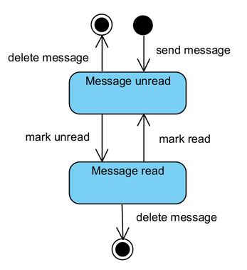
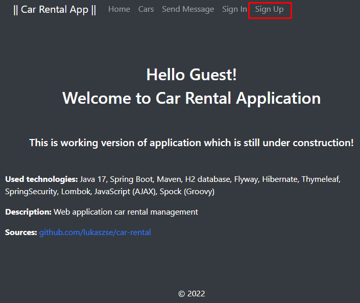
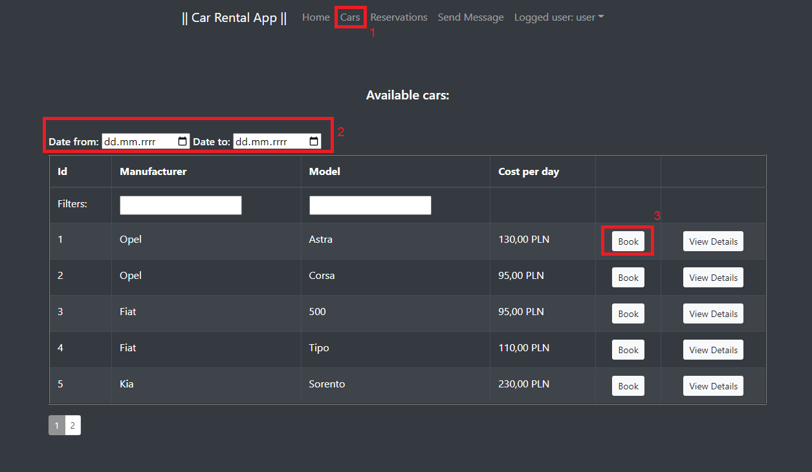
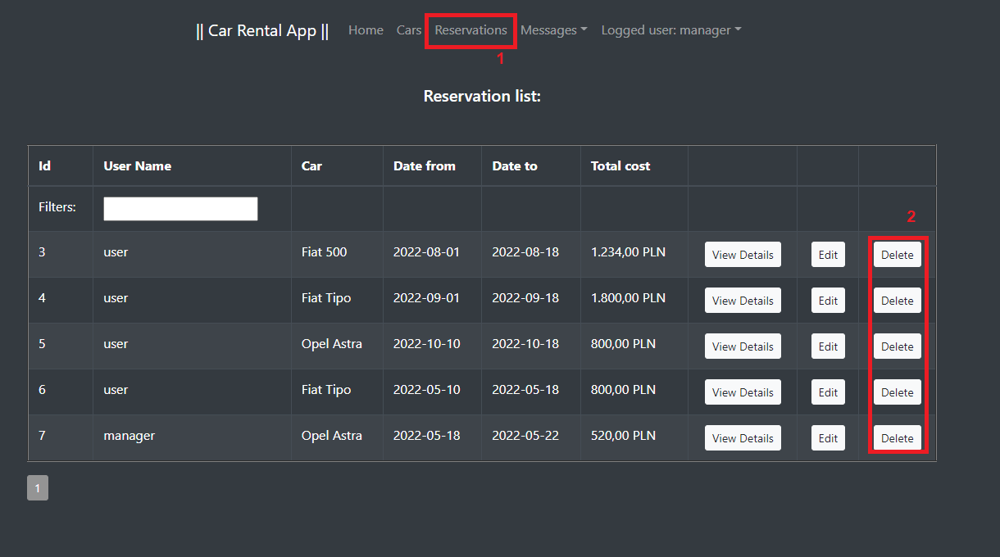
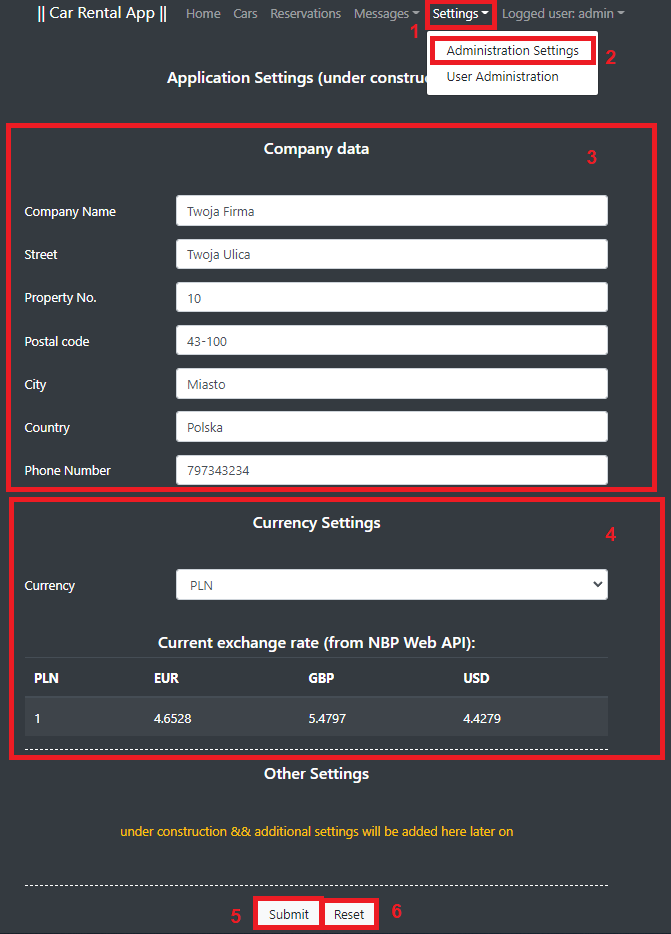

Pliki źródłowe niniejszej dokumentacji w formacie Markdown są dostępne pod poniższym adresem:  
https://github.com/lukaszse/car-rental/blob/master/dokumentacja/Dokumentacja.md

Działająca wersja MVP aplikacji dostępna jest pod adresem:  
https://ubuntu.llseremak.p3.tiktalik.io/car-rental/home

# 1. Cel projektu
Celem projektu jest zaprojektowanie oraz implementacja aplikacji webowej (w wersji MVP) wspomagającej procesy obsługi zleceń związanych z wypożyczaniem samochodów osobowych dla klientów indywidualnych.
Poprzez informatyzację wszystkich procesów obsługi klienta aplikacja zapewni szereg korzyści m.in.:
* redukcję kosztów obsługi zamówień poprzez ich całkowitą automatyzację,
* zwiększenie wydajności obsługi klientów,
* zapewnienie bezpieczeństwa danych przechowywanych w scentralizowanej bazie danych.

# 2. Słownik pojęć

* **MTFB** — (ang. Mean Time between Failures) średni czas pomiędzy wystąpieniem awarii<sup>1</sup>.
* **Docker** — otwarte oprogramowanie do wirtualizacji, umożliwiające "konteneryzację" tj. pozwalające umieścić program oraz jego zależności (biblioteki) w przenośnym wirtualnym kontenerze który można uruchomić na dowolnym serwerze z systemem Linux, Windows i MacOS<sup>2</sup>.
* **GUI** — (ang. Graphical User Interface) graficzny interfejs użytkownika.
* **RODO** — rozporządzenie o ochronie danych osobowych — rozporządzenie unijne, zawierające przepisy o ochronie osób fizycznych w związku z przetwarzaniem danych osobowych oraz przepisy o swobodnym przepływie danych osobowych<sup>3</sup>.
* **PDF** — (and. Portable Document Format) format plików służący do prezentacji, przenoszenia i drukowania treści tekstowo-graficznych, stworzony przez firmę Adobe Systems. Obecnie rozwijany i utrzymywany przez Międzynarodową Organizację Normalizacyjną<sup>4</sup>.
* **Spring Boot** — framework do budowania aplikacji, w tym aplikacji webowych w języku java<sup>5</sup>.
* **Thymeleaf** — silnik szablonów html<sup>6</sup>.
* **H2** — baza danych SQL przechowująca dane w pliku lub w pamięci operacyjnej, stosowana do testów lub prostych aplikacji<sup>7</sup>.
* **Spock** — framework do tworzenia testów jednostkowych, wykorzystujący język Groovy<sup>8</sup>.
* **MVP** — (ang. Minimum Viable Product) - produkt o minimalnej funkcjonalności potrzebnej do wprowadzenia na rynek<sup>9</sup>.
----------------------------------------------------------------------------
<sup>1</sup> https://pl.wikipedia.org/wiki/MTBF  
<sup>2</sup> https://www.docker.com/  
<sup>3</sup> https://pl.wikipedia.org/wiki/Og%C3%B3lne_rozporz%C4%85dzenie_o_ochronie_danych  
<sup>4</sup> https://pl.wikipedia.org/wiki/Portable_Document_Format  
<sup>5</sup> https://spring.io/projects/spring-boot  
<sup>6</sup> https://www.thymeleaf.org/  
<sup>7</sup> https://www.h2database.com/  
<sup>8</sup> https://spockframework.org/  
<sup>9</sup> https://www.biznesowerewolucje.com/mvp-minimum-viable-product-praktycznie/


# 3. Szczegółowy opis wymagań
## 3.1. Wymagania funkcjonalne do zaimplementowania w wersji MVP

System umożliwia:
* wyszukiwanie dostępnych w określonym terminie samochodów, wg zadanych kryteriów takich jak:
    * marka,
    * model;
* wyświetlenie szczegółowych informacji na temat wybranego pojazdu;
* rejestrację użytkowników;
* logowanie użytkowników;
* zarządzanie użytkownikami w trybie *Administratora* (dodawanie/edycja/usuwanie);
* przeglądanie pojazdów w trybie *Gościa*;
* dokonanie rezerwacji przez zarejestrowanego i zalogowanego użytkownika;
* odwołanie rezerwacji przez osobę zarządzającą;
* rejestrację użytkowników oraz modyfikację danych przez użytkowników;
* przeglądanie własnych rezerwacji;
* dodawanie/usuwanie oraz modyfikacje pojazdów przez osobę zarządzającą;
* przeglądanie listy zarezerwowanych oraz wypożyczonych samochodów przez osobę zarządzającą;
* obsługę płatności;
* generowanie i pobieranie potwierdzenia rezerwacji w formacie pdf;
* kontaktowanie się z obsługą wypożyczalni poprzez formularz kontaktowy;
* wysyłanie wiadomości do obsługi serwisu;
* wysyłanie wiadomości do obsługi w trybie *Gościa* zabezpieczone reCaptcha v2;
* walidacja dla wszystkich wprowadzonych pól wraz z systemem alertów/ostrzeżeń o źle wprowadzonych danych (pola o szczególnej składni jak kod pocztowy czy email walidowane z wykorzystaniem wyrażeń regularnych);
* zabezpieczenie ścieżek URL (dostęp do ścieżki tylko dla użytkowników uprawnionych);
* przypisywanie ról dla użytkowników przez *Administratora*;
* Bezpieczeństwo danych użytkownika np. poprzez wykorzystanie protokołu HTTPS;

## 3.2. Wymagania funkcjonalne do zaimplementowania w przyszłych wersjach oprogramowania
* rozszerzenie wyszukiwania dostępnych samochodów o kryteria takie jak:
    * rodzaj skrzyni biegów,
    * rodzaj silnika (benzyna/diesel/elektryczny);
* zmiana statusu z rezerwacji na wypożyczenie;
* generowanie faktur dla rezerwacji;
* generowanie korekty faktury w przypadku odwołania zlecenia.

## 3.3. Wymaganie niefunkcjonalne
* GUI:
    * aplikacja webowa z interfejsem dla przeglądarki internetowej,
    * spójny wygląd zgodnie z zaakceptowanym szablonem (spójna kolorystyka, menu, zachowanie się systemu).
* Dostępność:
    * obsługa języków: polski,
    * obsługa przeglądarek: Chrome, Safari, Edge.
* Niezawodność:
    * System dostępny 24/7. MTFB = 1000h.
* Bezpieczeństwo:
    * aplikacja jest uruchamiana tylko i wyłącznie używając protokołu https, który zapobiega przechwytywaniu i zmienianiu przesyłanych danych. A dodatkowo zaimplementowane zostało: 
      * haszowanie haseł,
      * automatyczne wylogowanie użytkownika po upływie 10 minut,
      * spełnia wymagania Ustawy z dnia 10 maja 2018 r. o
        ochronie danych osobowych (RODO).
* Tabele danych do wyświetlenia, w szczególności dla danych filtrowanych ładowane bez przeładowywania całej strony. Architektura typu Single Page Application nie jest wymagana, dopuszczalna jest architektura hybrydowa.

## 3.4. Ograniczenia
* System musi być instalowany z obrazu Dockera pobieranego online<sup>1</sup>.
* Wszystkie podstrony aplikacji działające wyłącznie przez HTTPS
* System musi być zgodny z ustawą o ochronie danych osobowych RODO.
* System musi obsługiwać przeglądarki Chrome i Edge.
* MVC zbudowane na podstawie plikową bazę danych zintegrowaną z aplikacją, aby wyeliminować konieczność tworzenia osobnej bazy danych.


<sup>1</sup> W celu uproszczenia wdrożenia aplikacji, autorzy zdecydowali się zastosować konteneryzację, a co za tym idzie udostępnić aplikacje jak obraz Dockera.

## 3.5. Architektura aplikacji

### 3.5.1. Aplikacja MVC
Aplikacja wykorzystywać będzie wzorzec projektowy MVC. Zgodnie ze wzorcem MVC będzie podzielona na 3 moduły:
* Model reprezentujący dane (np. pobierane z bazy danych czy parsowane z plików XML)
* Widok reprezentujący interfejs użytkownika 
* Kontroler, czyli logikę sterującą aplikacją
Logika sterująca kontrolera, ze względu na poprawienie czytelności kodu, będzie rozdzielona na kontroler, który będzie odpowiedzialny za obsługę zapytań zewnętrznych,
oraz serwis odpowiedzialny za realizację logiki biznesowej, oraz będący łącznikiem z warstwą modelu, zapewniającą dostęp do bazy danych. Taki podział będzie dotyczył się każdego z poszczególnych widoków aplikacji.

### 3.5.2. Aplikacja monolityczna / hybrydowa
Aplikacja zostanie zbudowana jako aplikacja monolityczna. Jednakże budowa systemu umożliwia przyszłą modularyzację, poprzez dołączenie dodatkowych mikroserwisów, które byłyby odpowiedzialne za nowe grupy funkcji.

### 3.5.3. Architektura warstwy klienckiej (frontend)
Frontend aplikacji zostanie stworzony z wykorzystaniem silnika szablonów Thymeleaf wspieranego przez Spring Boot. 
Oprócz statycznych szablonów warstwa frontend będzie wyposażona w dynamiczne elementy obsługiwane za pomocą JavaScript (AJAX), które zostaną wykorzystane m.in. do budowania dynamicznych tablic wspierających mechanizm wyszukiwania (filtrowania rekordów).


# 4. Użytkownicy (Aktorzy/Role)

## 4.1 Uprawnienia użytkowników
W systemie funkcjonować będą użytkownicy o następujących rolach:
1. *Administrator* (ang. Admin<sup>1</sup>)
- posiada uprawnienia wszystkich użytkowników, a ponadto ma możliwość zarządzania *Użytkownika*mi oraz przypisywania użytkownikom określonej roli.
2. *Zarządca* (ang. Manager<sup>1</sup>)
- posiada uprawnienia *Użytkownika* oraz *Gościa* a ponadto:
  - posiada możliwość przeglądania wszystkich rezerwacji,
  - posiada możliwość anulowania dowolnej rezerwacji (swojej lub innego użytkownika),
  - posiada możliwość modyfikacji dowolnej rezerwacji (w imieniu siebie lub innego użytkownika),
  - posiada możliwość złożenia rezerwacji za *Użytkownika* (np. rezerwacja telefoniczna).
3. *Użytkownik* (ang. User<sup>1</sup>)
- posiada uprawnienia *Gościa*, a ponadto:
  - posiada możliwość dokonywania rezerwacji,
  - posiada możliwość opłacania rezerwacji,
  - posiada możliwość przeglądania swoich rezerwacji,
  - posiada możliwość generowania faktur<sup>2</sup>.
4. *Gość* (ang. Guest<sup>1</sup>)
- posiada możliwość wyszukiwania pojazdów w wybranym terminie, spełniających wybrane kryteria.
----------------------------
<sup>1</sup> W związku z przewidywaną dwujęzycznością projektu, w diagramach dokumentacji zostały użyte określenia w stosunku do ról zarówno w języku polskim, jak i angielskim.  
<sup>2</sup> Opcja generowania faktur nie jest zaimplementowana w wersji MVP. Będzie zaimplementowana w kolejnych wersjach aplikacji.


## 4.2. Tworzenie użytkowników różnego typu

Po zainstalowaniu aplikacji w systemie będą stworzone trzy podstawowe konta użytkowników (*Adminisrator*, *Użytkownik*, *Zarządca*).
Po zainstalowaniu należy zmienić standardowe hasła użytkowników. Należy mieć na względzie, że zarządzanie użytkownikami możliwe jest tylko z poziomu administratora.
W tym celu należy wykorzystać konto stworzone automatycznie podczas instalacji. Z tego konta można utworzyć dodatkowe konta wszystkich typów.

Podczas rejestracji konta przez *Gościa* stworzone zostanie konto *Użytkownika*. Ewentualna zmiana roli możliwa jest wyłącznie przez konto administratora.


# 5. Diagramy przypadków użycia (wybrane przykłady)


# 6. Scenariusze przypadków użycia
Poniżej przedstawiono wybrane scenariusze przypadków użycia spośród wszystkich scenariuszy:
- logowanie do systemu,
- rejestracja użytkownika,
- wysłanie wiadomości do obsługi,
- odczyt wiadomości przez *Administratora*/*Zarządcę*,
- usuwanie wiadomości przez *Administratora*/*Zarządcę*,
- wyszukiwanie samochodów,
- rezerwacja samochodu,
- wyświetlanie listy wszystkich rezerwacji przez *Administratora*/*Zarządcę*,
- przeglądanie własnych rezerwacji przez użytkownika,
- zmiana danych własnych użytkownika,
- tworzenie użytkownika przez *Administratora*,
- edycja dowolnego użytkownika przez *Administratora*,
- usuwanie dowolnego użytkownika przez *Administratora*,
- wyświetlanie listy wypożyczeń.

## 6.1. Logowanie do systemu

## 6.2. Zmiana danych

## 6.3. Rezerwacja samochodu

## 6.4. Usuwanie wiadomości

## 6.5. Edycja danych dowolnego użytkownika

## 6.6. Dodanie nowego użytkownika


# 7. Model bazy danych

## 7.1. Model konceptualny


## 7.2. Model logiczny (ERD)
W ramach normalizacji bazy danych została stworzona tabela `Address`.
Tabele `Address` oraz `Invoice` ta nie występują w wersji MVP aplikacji. Zostania one zaimplementowana w kolejnych wersjach.


# 7.3. Model relacyjny (Fizyczny)


# 8. Diagramy czynności (wybrane przykłady)
Poniżej przedstawiono wybrane diagramy czynności. Wszystkie diagramy znajdują się na poniższej liście:
- logowanie do systemu,
- rejestracja użytkownika,
- wysłanie wiadomości do obsługi,
- odczyt wiadomości przez *Administratora*/*Zarządcę*,
- usuwanie wiadomości przez *Administratora*/*Zarządcę*,
- wyszukiwanie samochodów,
- rezerwacja samochodu,
- wyświetlanie listy wszystkich rezerwacji przez *Administratora*/*Zarządcę*,
- przeglądanie własnych rezerwacji przez użytkownika,
- zmiana danych własnych użytkownika,
- tworzenie użytkownika przez *Administratora*,
- edycja dowolnego użytkownika przez *Administratora*,
- usuwanie dowolnego użytkownika przez *Administratora*,
- wyświetlanie listy wypożyczeń.

## 8.1. Logowanie do systemu


## 8.2. Zmień dane użytkownika


## 8.3. Zmiana danych pojazdu (tylko *Administrator*/*Zarządca*)


## 8.4 Wyszukiwanie samochodów


## 8.5. Rejestracja użytkownika


# 9. Diagramy sekwencji (wybrane przykłady)
Poniżej przedstawiono wybrane diagramy sekwencji. Wszystkie diagramy znajdują się na poniższej liście:
- logowanie do systemu,
- rejestracja użytkownika,
- wysłanie wiadomości do obsługi,
- odczyt wiadomości przez *Administratora*/*Zarządcę*,
- usuwanie wiadomości przez *Administratora*/*Zarządcę*,
- wyszukiwanie samochodów,
- rezerwacja samochodu,
- wyświetlanie listy wszystkich rezerwacji przez *Administratora*/*Zarządcę*,
- przeglądanie własnych rezerwacji przez użytkownika,
- zmiana danych własnych użytkownika,
- tworzenie użytkownika przez *Administratora*,
- edycja dowolnego użytkownika przez *Administratora*,
- usuwanie dowolnego użytkownika przez *Administratora*,
- wyświetlanie listy wypożyczeń.

## 9.1. Logowanie do systemu


**Uwaga** Klasa `AuthorizationService` to klasa należąca do Spring Boot Security, tj. zestawu bibliotek pozwalających na obsługę funkcji bezpieczeństwa aplikacji.

## 9.2. Wyświetlanie listy wszystkich rezerwacji przez *Administratora*/*Zarządcę*


## 9.3. Wyszukiwanie samochodów


## 9.4 Usuwanie wiadomości


## 9.5 Usuwanie dowolnego użytkownika przez *Administratora*


---
<sup>1</sup> https://spring.io/projects/spring-boot

# 10. Diagramy stanów (wybrane przykłady)
## 10.1. Zarządzanie użytkownikami (tylko Administrator)

## 10.2. Status/rola zalogowanego użytkownika (tylko Administrator)

## 10.3. Zarządzanie wiadomościami (tylko *Zarządca*/*Administrator*)

## 10.4. Logowanie do systemu

## 10.5. Rejestracja użytkownika


**UWAGA** Diagram rejestracji przedstawia sposób rejestracji dla zwykłego użytkownika. Wszelkie role specjalne (*Zarządca*/*Administrator*) są przypisywane ręcznie przez *Administratora*


# 11. Diagram klas


# 12. Kod SQL
## 12.1. Standard tworzenia bazy danych
Struktura bazy danych budowana jest z wykorzystaniem narzędzia Flyway (https://flywaydb.org/), które odpowiada również za wypełnienie bazy danych danymi testowymi.
Z uwagi na fakt, że wersja MVP aplikacji nie posiada wszystkich projektowanych funkcji, również baza danych nie zawiera wszystkich tabel określonych na diagramie ERD.
Poniżej zamieszczono kod SQL do wszystkich tabel, z których aktualnie korzysta aplikacja. Wszystkie tablice dostępne są również w folderze aplikacji:
https://github.com/lukaszse/car-rental/tree/master/src/main/resources/db/migration`

## 12.2. Dialekt SQL
W projekcie wykorzystano bazę danych H2 oraz dialekt SQL H2 (https://www.h2database.com/).

## 12.3. Kod SQL

### 12.3.1. Tabela CAR
```sql
create table car (
                     id int primary key auto_increment,
                     registration_no varchar(255),
                     manufacturer varchar(255) not null,
                     model varchar(255) not null ,
                     fuel_type varchar(255) not null ,
                     type varchar(255) not null ,
                     engine_capacity int not null ,
                     passenger_number int not null ,
                     description varchar(255) not null,
                     cost_per_day numeric(19,2) not null
);
```

## 12.3.2. Tabela APP_USER
```sql
create table app_user (
    user_name  varchar(40) primary key,
    first_name varchar(255),
    last_name varchar(255),
    user_role varchar(255),
    password varchar(500)
);
```

## 12.3.3. Tabela RESERVATION
```sql
create table reservation (
    id int primary key auto_increment,
    user_name varchar(255) not null,
    car_id int not null,
    reservation_date date,
    date_from date,
    date_to date,
    total_cost numeric(19,2) not null,
    invoice_id varchar(255),
    rented bit,
    foreign key (car_id) references car(id),
    foreign key (user_name) references app_user(user_name)
);
```

## 12.3.4. Tabela MESSAGE
```sql
create table message (
    id int primary key auto_increment,
    user_name varchar(40),
    subject varchar(255),
    content varchar(1000),
    sent_date date,
    is_read bit
);
```

## 12.3.5. Dane testowe
Aplikacja w wersji MVP po zainstalowaniu posiada w bazie danej przykładowe dane testowe pozwalające na sprawdzenie działania aplikacji. Dane te można usunąć, po przekazaniu aplikacji do użytkowania.
W celu zapisania danych w bazie wykorzystano mechanizm migracji Flyway. Kod służący do dodania danych testowych (wraz z kodem do stworzenia tabel) znajduje się w poniższej lokalizacji:
https://github.com/lukaszse/car-rental/tree/master/src/main/resources/db/migration

# 13. Informacje dla developera

## 13.1. Zastosowane technologie i wymagania wobec developera
Aplikację napisano w języku Java w wersji 17 oraz z wykorzystaniem frameworku Spring Boot. W aplikacji wykorzystano także mechanizm szablonów Thymeleaf oraz elementy napisane w języku JavaScript.
Podstawowa znajomość wszystkich tych technologii jest konieczna do rozpoczęcia pracy z kodem aplikacji.
Przed rozpoczęciem pracy z kodem należy:
1. Zainstalować środowisko OpenJDK 17.
2. Zainstalować wybrane środowisko IDE (np. IntelliJ lub Eclipse).
3. Zainstalować aplikację Docker.

## 13.2. Korzystanie z repozytorium 
Aby skorzystać z repozytorium, należy na lokalnej maszynie zainstalować aplikację Git do kontroli wersji.
Aplikacja jest dostępna dla systemów Windows, Linux oraz MacOS:
https://git-scm.com/
Kod źródłowy aplikacji Car-Rental znajduje się w repozytorium w serwisie GitHub:
https://github.com/lukaszse/car-rental

W celu pobrania repozytorium użyj komendy:

`git clone https://github.com/lukaszse/car-rental.git`

## 13.3. Uruchamianie aplikacji
Aby uruchomić aplikację, należy zbudować plik jar. W tym celu należy użyć komendy:  
`./mvnw clean install`

plik jar zostanie stworzony w folderze `/target`. Plik jar można uruchomić przy pomocy komendy:  
`java -jar nazwa_pliku.jar`


## 13.4. Konfiguracja
W aplikacji skonfigurowano dwa profile **LOCAL** służący do uruchamiania aplikacji na lokalnym komputerze (z rozszerzonymi opcjami logowania, debbugowania oraz dostępem bez szyfrowania TSL) oraz **PROD** służący do uruchomienia aplikacji produkcyjnej na serwerze.
Profil można przełączyć poprzez modyfikację zmiennej `spring.profiles.active=prod`, która znajduję się w pliku `src/main/resources/application.properties`.
Szczegółowe konfiguracje dla środowisk znajdują się w plikach `application-local.yml` oraz application-prod.yml` znajdujących się w tej samej lokalizacji.

# 13.5 Obraz Docker
W głównym folderze aplikacji znajduje się plik `Dockerfile`, który służy do zbudowania obrazu z aktualnego pliku jar znajdującego się w folderze `target`.
Aby zbudować obraz name użyć komendy:  
`docker build -t nazwaObrazu .`  

W celu zapisania obrazu w repozytorium zdalnym Docker'a (tak, aby był dostępny on online dla publicznie), należy użyć komendy:  
`docker push nazwaObrazu`

## 13.6. Wybrane szczegóły implementacji - algorytm sprawdzania dostępności samochodu w danym przedziale czasu

W aplikacji zastosowano mechanizm sprawdzania dostępności samochodu w danym przedziale czasu.
Algorytm ten wykorzystywany jest w dwóch sytuacjach:
1. Wyszukiwanie samochodów w widoku **cars** - użytkownik ma możliwość wpisania zakresu czasu (`dateFrom` oraz `dateTo`),w celu wyszukiwania dostępnych do wypożyczenia samochodów. Mechanizm ten realizowany jest z wykorzystaniem zapytania REST API **@GET**, które zaimplementowane zostało z wykorzystaniem Javascript (AJAX).
   Do obsługi zapytania **@GET** utworzono endpoint `cars/findCars`, który przyjmuje m.in. dwa parametry QueryParam - `dateFrom` oraz `dateTo`.


3. Rezerwowanie samochodu (dodawanie rezerwacji) - po wyszukaniu samochodu użytkownik w widoku **cars** ma możliwość zarezerwowania wybranego samochodu przez kliknięcie przycisku **Book**, a następnie poprzez potwierdzenie zamówienia przez kliknięcie przycisku **Submit** na ekranie z danymi samochodu, co spowoduje wysłanie zapytania **@POST** oraz wywołanie metody 'performAddReservation' która przyjmuje kilka paramerów, w tym parametry `dateFrom` oraz `dateTo`.
   Przed zarezerwowaniem samochodu również sprawdzana jest dostępność samochodu, a operacja przeprowadzana jest w formie transakcji.


Obie wyżej wymienione metody korzystają z klasy `AvailabilityService` oraz zaimplementowanego w niej algorytmu:

```java
    public boolean isCarAvailable(final Integer carId, final TimePeriod timePeriod) {
        if(timePeriod.getDateFrom() == null && timePeriod.getDateTo() == null) {
            return true;
        }
        return reservationSearchRepository.findByCar_Id(carId).stream()
                .map(reservation -> TimePeriod.of(reservation.getDateFrom(), reservation.getDateTo()))
                .noneMatch(reservationPeriod -> checkIfPeriodOverlap(timePeriod, reservationPeriod));
    }

    private static boolean checkIfPeriodOverlap(final TimePeriod timePeriod1, TimePeriod timePeriod2) {
        final LocalDate s1 = timePeriod1.getDateFrom();
        final LocalDate e1 = timePeriod1.getDateTo();
        final LocalDate s2 = timePeriod2.getDateFrom();
        final LocalDate e2 = timePeriod2.getDateTo();

        if(s1 == null || e1 == null || s2 == null || e2 == null) {
            return false;
        }

        if(s1.compareTo(s2)<=0 && e1.compareTo(s2)>=0 ||
                s1.compareTo(e2)<0 && e1.compareTo(e2)>0 ||
                s1.compareTo(s2)<0 && e1.compareTo(e2)>0 ||
                s1.compareTo(s2)>0 && e1.compareTo(e2)<0 )
        {
            log.info("Periods overlap! Period 1: {}, Period2: {}", timePeriod1, timePeriod2);
            return true;
        }
        else {
            return false;
        }
    }
```

Jak widać (co wynika z powyższego kodu) metoda `isCarAvailable` wywołuje zapytanie bazy danych z wykorzystaniem `RepositorySearchService` w celu pobrania wszystkich rezerwacji dla danego samochodu, a następnie sprawdza, czy jakikolwiek okres z pobranych rezerwacji nie pokrywa się z okresem rezerwacji wymaganym przez użytkownika.
Jeśli żaden z tych okresów się nie pokrywa `noneMatch` metoda zwraca `true`, w przeciwnym razie `false`.
Samo sprawdzenie, czy pojedynczy pobrany z bazy danych okres rezerwacji pokrywa się z okresem rezerwacji wymaganym przez użytkownika, sprawdzane jest w metodzie 'checkIfPeriodOverlap'.
Niniejszy algorytm przedstawiono na poniższych schematach blokowych (zastosowano osobny schemat dla metody `checkIfPeriodsOverlap`):


# 14. Testowanie
Podstawową formą testów aplikacji będą testy jednostkowe oraz
integracyjne pisane na bieżąco, w trakcie powstawania kodu źródłowego, pisane
przez zespół testerski.
Co więcej, w uzgodnieniu z użytkownikami aplikacji przygotowane zostanie
około 20 różnych przypadków testowych. Testy realizować będzie zespół testerów.
W tym celu utworzone zostanie środowisko testowe, na którym zostanie
uruchomiona pełna funkcjonalność aplikacji. Przypadki testowe będą zawierały m.in. przypadki dodawania nowych samochodów, dodawania użytkowników,
rezerwacji samochodów itd.
Dodatkowo zostaną przeprowadzone testy wydajnościowe aplikacji dla
określonej grupy wirtualnych użytkowników.
## 14.1. Testy jednostkowe
W aplikacji wykorzystano testowy framework Spock oraz testy jednostkowe napisane w języku Groovy.
Spock umożliwia między innymi tworzenie testów wykorzystujących koncepcję Data Driven Tests.

### 14.1.1 Testowanie metody sprawdzającej dostępność samochodów
Jak opisano w punkcie 14.2.1., w aplikacji zastosowano algorytm sprawdzania dostępności pojazdów, który znajduje się w klasie `AvailabilityService`.
Algorytm ten wykorzystuje metodę `checkIfPeriodsOverlap`, która sprawdza, czy dwa okresy się pokrywają (okres 'TimePeriod' jest obiektem zawierającym dwie daty
- datę "od" oraz datę "do").
Poniżej zamieszczono kod testu jednostkowego sprawdzającego poprawność działania metody `checkIfPeriodsOverlap`:
```groovy
    @Unroll
    def "should check if data ranges overlap correctly - test #no"() {

        when: "invoke method to check if data ranges overlaps"
        def overlap = availabilityService.checkIfPeriodsOverlap(firstPeriod, secondPeriod)

        then: "should check correctly if data ranges overlap"
        overlap == expectedResult

        where:
        no | firstPeriod           | secondPeriod          || expectedResult
        1  | getTimePeriod(1, 2)   | getTimePeriod(3, 4)   || false
        2  | getTimePeriod(2, 4)   | getTimePeriod(3, 5)   || true
        3  | getTimePeriod(1, 4)   | getTimePeriod(20, 30) || false
        4  | getTimePeriod(10, 14) | getTimePeriod(7, 13)  || true
        5  | getTimePeriod(10, 14) | getTimePeriod(7, 60)  || true
        7  | getTimePeriod(1, 200) | getTimePeriod(7, 60)  || true
        8  | getTimePeriod(1, 3)   | getTimePeriod(1, 3)   || true
        9  | getTimePeriod(5, 8)   | getTimePeriod(1, 3)   || false
    }

    static def getTimePeriod(final int plusDaysFrom, final int plusDaysTo) {
        TimePeriod.of(LocalDate.now().plusDays(plusDaysFrom), LocalDate.now().plusDays(plusDaysTo))
    }
```
Aby uruchomić test, konieczne było utworzenie protez ("mocks") dla wykorzystanych obiektów:
```groovy
    ReservationSearchRepository repository = Mock()
    AvailabilityService availabilityService = new AvailabilityService(repository)
```
Odnośnik do klasy testowej: https://github.com/lukaszse/car-rental/blob/master/src/test/groovy/org/lukaszse/carRental/service/AvailabilityServiceSpec.groovy

### 14.1.2 Walidacja daty
W aplikacji wykorzystano mechanizm adnotacji do walidowania m.in. danych przychodzących z zewnątrz (z przeglądarki internetowej do serwera).
Stworzono, także m.in. niestandardową adnotację `@ValidateTimePeriod` oraz walidator do sprawdzania poprawności wprowadzanych dat.
Walidator stanowi odrębną klasę, z główną metodą `isValid`, która używa odpowiedniej logiki do zweryfikowania poprawności wprowadzonego okresu (TimePeriod).
Walidator sprawdza m.in. czy nie wprowadzono daty z przeszłości oraz, czy data "od" nie jest wcześniejsza niż data "do".
W celu sprawdzenia poprawności działania walidatora przygotowano test jednostkowy weryfikujący poprawność działania metody `isValid`:

```groovy
    def "should validate TimePeriod correctly"() {

        expect: 'should return correct validation result'
        timePeriodValidator.isValid(timeperiod, constraintValidatorContext) == expectedResult

        where:
        timeperiod                                                                || expectedResult
        TimePeriod.of(LocalDate.now().plusDays(2), LocalDate.now().plusDays(3))   || true
        TimePeriod.of(LocalDate.now().plusDays(5), LocalDate.now().plusDays(3))   || false
        TimePeriod.of(LocalDate.now().minusDays(5), LocalDate.now().plusDays(3))  || false
        TimePeriod.of(LocalDate.now().minusDays(5), LocalDate.now().minusDays(3)) || false
        TimePeriod.of(LocalDate.now().plusDays(3), LocalDate.now().plusDays(3))   || true
    }
```

Metoda testowa wykorzystuje protezy obiektów ("mocks"):
```groovy
    TimePeriodValidator timePeriodValidator = new TimePeriodValidator();
    ConstraintValidatorContext constraintValidatorContext = Mock()
```

### 14.1.3 Testowanie metody obliczającej koszt całkowity rezerwacji
W aplikacji wykorzystano metodę statyczną `calculateTotalCost` służącą do obliczania kosztu całkowitego rezerwacji w danym przedziale czasowym, który został wybrany wcześniej przez użytkownika, i po cenie rezerwacji za dzień, określonej przez administrację serwisu.
W celu sprawdzenia poprawności działania metody przygotowano test jednostkowy:

```groovy
def "should check if data ranges equals correctly - test #no"() {

        given: "Prepare dates"
        def localDateFrom = LocalDate.parse(dateFrom)
        def localDateTo = LocalDate.parse(dateTo)

        when: "Try to calculate cost"
        def overlap = ReservationService.calculateTotalCost(localDateFrom, localDateTo, costPerDay as BigDecimal)

        then: "Cost should be calculated correctly"
        overlap == expectedResult

        where:
        no | dateFrom       | dateTo         |  costPerDay  || expectedResult
        1  | "2018-05-20"   | "2018-06-02"   | 100          || 1300
        2  | "2019-03-10"   | "2019-05-22"   | 70           || 5110
        3  | "2018-03-20"   | "2018-03-22"   | 200          || 400
        4  | "2000-09-01"   | "2000-09-30"   | 50           || 1450
    }
```

### 14.1.4 Testowanie metody zmieniającej hasło użytkownika
W klasie `UserService` znajduje się metoda `changePassword`, jest to metoda pomocnicza służąca do zmiany hasła użytkownika.
  Poniżej zamieszczono kod testu jednostkowego sprawdzającego poprawność działania metody:
```groovy
    def "should change password"() {

        given: "Mock all required methods"
        userRepository.findUserByUserName(_ as String) >> Optional.of(prepareUser())
        passwordEncoder.matches(_ as String, _ as String) >> true
        passwordEncoder.encode(_ as String) >> "some encrypted password"
        userService.passwordEncoder = passwordEncoder


        and: "prepare prepareChangePasswordDto object"
        def passwordChangeDto = prepareChangePasswordDto(oldPassword, newPassword, newPasswordConfirm)

        when: "try to change password"
        userService.changePassword(userName, passwordChangeDto)

        then: "should throw now exception and invoke changePassword() method once"
        noExceptionThrown()
        1 * userRepository.changePassword(_ as String, _ as String)

        where:
        no | userName | oldPassword | newPassword | newPasswordConfirm
        1  | "joe"    | "password"  | "qwerty"    | "qwerty"
        2  | "joe"    | "password"  | "123456"    | "123456"
    }

    def "should throw exception while trying to change password with wrong data"() {

        given: "Mock all required methods"
        userRepository.findUserByUserName(_ as String) >> Optional.of(prepareUser())
        passwordEncoder.matches(_ as String, _ as String) >> passwordEncoderMatch
        passwordEncoder.encode(_ as String) >> "some encrypted password"
        userService.passwordEncoder = passwordEncoder


        and: "prepare prepareChangePasswordDto object"
        def passwordChangeDto = prepareChangePasswordDto(oldPassword, newPassword, newPasswordConfirm)

        when: "try to change password"
        userService.changePassword(userName, passwordChangeDto)

        then: "should throw exception and not change password"
        thrown(WrongPayloadException.class)
        0 * userRepository.changePassword(_ as String, _ as String)

        where:
        no | userName | oldPassword | newPassword | newPasswordConfirm | passwordEncoderMatch
        1  | "joe"    | "password"  | "qwerty2"   | "qwerty"           | true
        2  | "joe"    | "password"  | "1234562"   | "123456"           | true
        3  | "joe"    | "password"  | "123456"    | "123456"           | false
    }

    def static prepareChangePasswordDto(String oldPassword, String newPassword, String newPasswordConfirm) {
        def passwordChangeDto = new PasswordChangeDto()
        passwordChangeDto.setOldPassword(oldPassword)
        passwordChangeDto.setNewPassword(newPassword)
        passwordChangeDto.setNewPasswordConfirm(newPasswordConfirm)
        passwordChangeDto
    }

    def static prepareUser() {
        def user = new User()
        user.setUserName("Joe")
        user.setPassword('{bcrypt}\$2a\$12$feoSS.Dx/rRdQWfWHeWYZu8txsYcy8Dxt89MWd9U3O8r4CaAKKY3S')
        // Password = password
        user
    }
}

```
Aby uruchomić test, konieczne było utworzenie protez ("mocks") dla wykorzystanych obiektów:
```groovy
    PasswordEncoder passwordEncoder = Mock()
    UserRepository userRepository = Mock()
    UserService userService = new UserService(userRepository)
```

# 14.2 Przypadki testowe dla testów manualnych

### 14.2.1. Logowanie do aplikacji
**Cel:** Sprawdzenie możliwości zalogowania dla użytkowników o różnych uprawnieniach

**Warunki początkowe** 
- W aplikacji istnieją aktywne konta użytkowników dla każdej roli tj. użytkownika, *Administratora* i *Zarządcę*.
- Użytkownik znajduje się na ekranie powitalnym aplikacji

| Krok                           | Rezultat                       |
|--------------------------------|--------------------------------|
| 1. Kliknij na `Sign In` (menu) | 1′. Wyświetlono ekran logowania |
| 2. Wprowadź login i hasło      | 2′. Uzupełniono pola formularza |
| 3. Naciśnij przycisk zaloguj   | 3′. Zalogowano do systemu       |

**Priorytet:** wysoki  
**Wykonanie** manualne  
**Szacowany czas:** 1 min. dla każdego logowania  
**Uwagi:** powtórzyć dla każdej roli [user, manager, admin]

### 14.2.2. Wyszukiwanie samochodu
**Cel:** Sprawdzenie możliwości wyszukania samochodu

**Warunki początkowe**
- Użytkownik zalogowany w systemie [user, manager, admin]
- W bazie danych znajduje się dostępne samochody (utworzone automatycznie dla celów testowych)
- Przed rozpoczęciem testu sprawdzić w bazie danych samochody dostępne dla wybranego okresu

| Krok                                                         | Rezultat                                                                     |
|--------------------------------------------------------------|------------------------------------------------------------------------------|
| 1. Kliknij na `Cars` (menu)                                  | 1′. Wyświetlono z dostępnymi samochodami                                      |
| 2. Wprowadź wybrany okres (dateFrom i dateTo)                | 2′. Wyświetlono samochody dostępne w danym okresie                            |
| 3. Wprowadź pierwsze znaki marki samochodu i naciśnij enter  | 3′. Wyświetlono samochody których marka rozpoczyna się od wprowadzonych liter |
| 4. Wprowadź pierwsze znaki modelu samochodu i naciśnij enter | 4′. Wyświetlono samochody których model rozpoczyna się od wprowadzonych liter |
| 5. Klinij przycisk `View Details` dla wybranego samochodu    | 5′. Wyświetlono szczegóły samochodu                                           |


**Priorytet:** wysoki  
**Wykonanie** manualne  
**Szacowany czas:** 1 min. dla każdej roli + 2 min. na sprawdzenie danych w bazie.  
**Uwagi:** powtórzyć dla każdej roli [user, manager, admin]

### 14.2.3. Rejestracja
**Cel:** Sprawdzenie możliwości rejestracji *Gościa*

**Warunki początkowe**
- Wejście na stronę jako użytkownik niezarejestrowany w bazie.
- Użytkownik znajduje się na ekranie powitalnym aplikacji

| Krok                                                         | Rezultat                             |
|--------------------------------------------------------------|--------------------------------------|
| 1. Kliknij na `Sign Up` (menu)                               | 1′. Wyświetlono ekran rejestracji     |
| 2. Wprowadź login i hasło                                    | 2′. Uzupełniono formularz rejestracji |
| 3. Naciśnij `Submit`                                         | 3′. Następuje rejestracja             |

**Priorytet:** wysoki  
**Wykonanie** manualne  
**Szacowany czas:** 1 min.
**Uwagi:** Brak

### 14.2.4. Wysyłanie wiadomości przez niezalogowanego użytkownika
**Cel:** Sprawdzenie możliwości wysłania wiadomości

**Warunki początkowe**
- Użytkownik niezalogowany w systemie
- Użytkownik znajduje się na ekranie powitalnym aplikacji

| Krok                                               | Rezultat                                     |
|----------------------------------------------------|----------------------------------------------|
| 1. Kliknij na `Send Message` (menu)                | 1. Wyświetlono ekran wysyłania wiadomości    |
| 2. Wprowadź imię, temat i treść, zatwierdź captchę | 2. Uzupełniono formularz wysyłania wiadomości |
| 3. Naciśnij `Submit`                               | 3. Następuje wysłanie wiadomości             |

**Priorytet:** niski  
**Wykonanie** manualne  
**Szacowany czas:** 1 min  
**Uwagi:** Brak

# 15. Diagram głównych komponentów systemu

Powyższy diagram komponentów przedstawia główne komponenty systemu z wyłączeniem bazy danych.

# 16. Wdrożenie
## 16.1. Diagramy wdrożenia
### 16.1.1. Wdrożenie z wykorzystaniem kontenera Docker


**Uwaga** W wersji MVP aplikacja może wyświetlać się niepoprawnie na urządzeniach mobilnych, ze względu na brak skalowania tabel

## 16.2. Wymagania systemowe
Aplikacja napisana została w wieloplatformowym języku Java. Działa na każdym systemie z systemem operacyjnym Windows, Linux czy MacOS.
Poniżej przedstawiono szczegółowe wymagania systemowe.

Wymagania systemowe:
* System operacyjny Windows 10/11, MacOs, Linux oraz inne systemy z rodziny Unix.
* Zainstalowana maszyna wirtualna Javy w wersji minimum 17 (JRE / JDK 17) w przypadku uruchamiania aplikacji z pliku jar.
* Zainstalowane oprogramowanie Docker w przypadku uruchamiania aplikacji z obrazu docker. Zalecana wersja 20.10.10 lub wyższa.

## 16.3. Instalacja z wykorzystaniem pliku jar
Skopiować plik na serwer oraz uruchomić komendę:  
`java -jar nazwa_pliku.jar`

## 16.4. Instalacja z wykorzystaniem obrazu Docker
Aby ściągnąć obraz Dockera zawierający aplikację, należy użyć kolejno komend:  
`docker pull llseremak/car-rental`

Aby pobrać obraz, a następnie:  
`docker run -d --restart unless-stopped -p 443:443 llseremak/car-rental`

gdzie pierwszy port 443 to port, pod którym aplikacja będzie dostępna z zewnątrz kontenera (port 443 jest portem domyślnym da połączeń szyfrowanych z wykorzystaniem TSL)

## 16.5. Dodatkowa konfiguracja z wykorzystaniem NGINX
Przy pomocy NGINX można skonfigurować przekierowanie z portu, na którym działa aplikacja do określonego adresu url.
Dokumentacja NGINX: http://nginx.org/en/docs/

## 16.5. Bezpieczeństwo i certyfikat HTTPS
W wersji demonstracyjnej aplikacji wykorzystano niezarejestrowany certyfikat HTTPS. Gwarantuje on szyfrowanie danych przesyłanych z przeglądarki do serwera, jednak nie jest to certyfikat wydany przez Urząd Certyfikacji, wobec czego nie będzie traktowany przez przeglądarkę jako certyfikat zaufany.

Wymagać to może, odpowiednich kroków w zależności od konkretnej przeglądarki. W większości przypadków konieczne będzie wybranie opcji zaawansowanych[1], w celu wyświetlenia możliwości otwarcia strony[2].


# 17. Podręcznik użytkownika

**Spis treści**
1. Rejestrowanie użytkownika
2. Logowanie do systemu
3. Wyszukiwanie dostępnych pojazdów
4. Składanie rezerwacji
5. Przeglądanie rezerwacji oraz usuwanie rezerwacji
6. Wysyłanie wiadomości
7. Funkcje dostępne dla *Zarządcy*
   1. Edycja pojazdów 
   2. Usuwanie pojazdów 
   3. Przeglądanie rezerwacji wszystkich użytkowników 
   4. Edycja rezerwacji 
   5. Usuwanie rezerwacji 
   6. Odczytywanie wiadomości
8. Funkcje dostępne dla *Administratora*
   1. Zarządzanie użytkownikami
      1. Dodawanie użytkownika
      2. Edycja użytkownika
   2. Ustawienia administracyjne

## Wstęp
Aby zapewnić odpowiednią czytelność strony, autorzy aplikacji skorzystali ze standardowej biblioteki stylów Bootstrap (https://getbootstrap.com/)

## 17.1. Rejestrowanie użytkownika

W celu rejestracji należy wejść na stronę aplikacji: https://ubuntu.llseremak.p3.tiktalik.io/car-rental  
Po przekierowaniu do strony startowej należy kliknąć zakładkę `Sign Up` w głównym menu w celu przekierowania do formularza rejestracyjnego.



Następnie należy uzupełnić formularz rejestracyjny.


Wpisane przez użytkownika dane są walidowane. W przypadku wpisania błędnych lub niepełnych danych zostanie zwrócony komunikat o błędzie.


Komunikat wystąpi także, jeśli użytkownik o danym loginie już istnieje.


Po wpisaniu prawidłowych danych rejestracyjnych zostanie utworzone nowe konto, a użytkownik zostanie przekierowany na stronę logowania.


## 17.2. Logowanie do systemu

W celu zalogowania się do aplikacji należy wejść na główną stronę aplikacji, 
a następnie kliknąć zakładkę `Sign In` w głównym menu, w celu przekierowania do formularza logowania.
Następnie należy wpisać prawidłowy login oraz hasło. 


W przypadku wpisania błędnych danych użytkownik nie zostanie zalogowany, a na ekranie zostanie wyświetlony stosowny komunikat.


**Uwaga**: W wersji MVP na ekranie logowania znajdują się informację o danych do logowania do kont dla wszystkich
typów użytkowników.

## 17.3. Wyszukiwanie dostępnych pojazdów
Aby wyświetlić ekran wyszukiwania samochodów, należy kliknąć zakładkę `Cars` w górnym menu [1].
Wstępnie zostaną wyświetlone wszystkie samochody. Aby wyszukać samochód dostępny w danym terminie, należy wprowadzić dwie daty `dateFrom` oraz `dateTo` [2].
Po wpisaniu dat wyświetlone zostaną wszystkie samochody dostępne w danym terminie. Aby zawęzić wyszukiwania można użyć dodatkowych filtrów [3] w celu wprowadzenia marki oraz modelu samochodu.
Na ekranie wyświetlane jest pierwsze 5 znalezionych pojazdów, aby wyświetlić pozostałe wyniki, należy przejść do kolejnych stron wyszukiwania, w tym celu należy kliknąć 
numer strony znajdujący się pod wynikami wyszukiwania.


**Uwaga:** W wersji MVP aplikacji nie zaimplementowano sortowania ani możliwości wyboru ilości stron do wyświetlenia na ekranie logowania. Funkcje te znajdą się w pełnej wersji aplikacji.

## 17.4. Składanie rezerwacji

W celu złożenia rezerwacji musimy posiadać konto w serwisie. Po rejestracji lub zalogowaniu (kroki 19.1 i 19.2) należy podobnie jak w kroku 19.3, kliknąć zakładkę `Cars` [1] dzięki której uzyskamy dostęp do pełnej listy pojazdów.
W celu zarezerwowania pojazdu należy najpierw określić termin, w jakim chcielibyśmy dokonać rezerwacji [2].
Następnie wybrać dostępny w tym terminie pojazd naciskając przycisk `Book` [3], dzięki któremu uzyskamy dostęp do podglądu potwierdzenia naszej rezerwacji.



Po dokładnym zapoznaniu się z danymi rezerwacji należy wcisnąć przycisk `Submit` [1] potwierdzający złożenie rezerwacji w określonym terminie i po określonej cenie lub przycisk `Go Back` który pozwala na rezygnację z rezerwacji i powrót do okna listy dostępnych pojazdów [2].


## 17.5 Przeglądanie rezerwacji oraz usuwanie rezerwacji

Aby wyświetlić listę złożonych rezerwacji, należy po zalogowaniu lub rejestracji wejść w zakładkę `Reservations` [1].
Wyświetlona zostanie lista rezerwacji złożonych na tym koncie, nazwa pojazdu, czas rezerwacji oraz jej koszt.
W celu zobaczenia dokładnych danych pojedynczej rezerwacji należy nacisnąć przycisk `View Details` [2]. 
Program pozwala również na anulowanie zamówienia za pomocą przycisku `Cancel Reservation` [3].


Po naciśnięciu przycisku `View Details` uzyskamy dostęp do panelu pozwalającego na podgląd danych dotyczących tylko jednego wybranego zamówienia.
Panel ten pozwala nam również na anulowanie zlecenia `Cancel Reservation` [1] oraz wygenerowanie pliku PDF z wszystkimi danymi tego zlecenia `Generate PDF` [1].

**Uwaga**: Panel zawiera również funkcję `Edit` [3] pozwalającą na edytowanie zlecenia. Funkcja ta jest dostępna tylko dla Zarządcy lub *Administratora*.


## 17.6 Wysyłanie wiadomości

W celu wysłania wiadomości do administracji **jako użytkownik niezalogowany** należy nacisnąć w panel `Send Message` [1], a następnie uzupełnić formularz zgodnie z tytułami pól.
Po uzupełnieniu formularza należy potwierdzić pole captcha w `verify` zabezpieczające przed spamem [2].


W razie próby wysłania wiadomości jako **zalogowany użytkownik**, panel ten wygląda trochę inaczej. Pole z imieniem jest uzupełniane automatycznie według loginu użytkownika.


## 17.7. Funkcje dostępne dla *Zarządcę*

Wszystkie funkcje przedstawione w tym rozdziale jest niedostępne dla zwykłego użytkownika. W celu ich obsługi przez osobę zarządzającą została stworzona rola zarządcy.

### 17.7.1 Edycja pojazdów

W celu edycji danych pojazdu trzeba udać się do panelu `Cars` [1], a następnie kliknąć przycisk `Edit` [2] na wybranym pojeździe, który chcemy edytować.


Po wykonaniu tych kroków uzyskujemy widok edycji pojazdu. Aby edytować pojazd, należy uzupełnić formularz, a następnie zatwierdzić go przyciskiem `Submit` [1]. W przypadku chęci powrotu do danych początkowych na należy nacisnąć przycisk `Reset` [2].


### 17.7.2 Usuwanie pojazdów

W celu usunięcia pojazdu należy wejść w panel `Cars` [1], a następnie wcisnąć przycisk `Delete` na wybranym pojeździe [2]. 


### 17.7.3 Przeglądanie rezerwacji wszystkich użytkowników 

Aby wyświetlić listę wszystkich rezerwacji użytkowników, należy wejść w panel `Reservations` [1]. Na ekranie wyświetli się lista zarezerwowanych samochodów wraz z loginem użytkownika, który zarezerwował dany pojazd. 


### 17.7.4 Edycja rezerwacji 

W celu edycji danych rezerwacji trzeba udać się do panelu `Reservations` [1], a następnie kliknąć przycisk `Edit` [2] na wybranej rezerwacji,, którą chcemy edytować.


Uzyskujemy tym sposobem widok edycji rezerwacji. W celu edycji pojazdu należy uzupełnić formularz, a następnie zatwierdzić go przyciskiem `Submit` [1]. W przypadku chęci powrotu do danych początkowych na należy nacisnąć przycisk `Reset` [2].


### 17.7.5 Usuwanie rezerwacji 

W celu usunięcia rezerwacji należy wejść w panel `Reservations` [1], a następnie wcisnąć przycisk `Delete` na wybranej rezerwacji [2].



### 17.7.6 Odczytywanie i zarządzanie wiadomościami

*Zarządca* ma możliwość odczytywania wiadomości od użytkowników dotyczących wynajmu. W celu dostania się do panelu wiadomości należy nacisnąć `Messages` [1], a następne z rozsuwanej listy wybrać `View Messages` [2].
W przypadku chęci przeczytania pełnej treści wiadomości należy nacisnąć przycisk `View` [3]*, a w przypadku chęci usunięcia wiadomości należy nacisnąć przycisk `Delete` [4].


**Uwaga**: W wersji MVP podgląd wiadomości nie został zaimplementowany.


## 17.8 Funkcje dostępne dla *Administratora*

Administrator to specjalny użytkownik zawierający oprócz wszystkich funkcji poniżej dostęp dwóch specjalnych funkcji przeznaczonych tylko dla niego.

### 17.8.1 Zarządzanie użytkownikami

W celu dostania się do panelu zarządzania użytkownikami należy nacisnąć przycisk `Settings` [1], a następnie z rozsuwanej listy `User Administration` [2].
Panel ten pozwala nam na dodawanie (przycisk `Add User` [3], edycję (przycisk `Edit` [4]) oraz usuwanie użytkowników (przycisk `Delete` [5].


#### 17.8.1.1 Dodawanie użytkownika

Po wciśnięciu przycisku `Add User` uzyskujemy dostęp do formularza, w którym dodajemy dane nowego użytkownika oraz przypisujemy mu określoną rolę.  
Wszelkie zmiany należy zatwierdzić przyciskiem `Submit` [1], natomiast w przypadku chęci wyczyszczenia formularza należy użyć przycisku `Reset` [2].


#### 17.8.1.2 Edycja użytkownika

Po użyciu przycisku `Edit` na wybranym użytkowniku wyświetla się formularz edycji, w którym możemy dokonać potrzebnych nam zmian.
Każdą zmianę należy zatwierdzić przyciskiem `Submit` [1], natomiast w przypadku chęci wyczyszczenia formularza należy użyć przycisku `Reset` [2].


### 17.8.2 Ustawienia administracyjne

**UWAGA**: Panel ustawień administracyjnych w wersji MVP jest wyłącznie pokazowy, wszelkie funkcje nie zostały jeszcze zaimplementowane.

Aby dostać się do ustawień administracyjnych trzeba wejść w panel `Settings`[1], a następnie z rozwijanej listy wybrać `Administration Settings`.
Panel ten pozwala nam na zmianę danych dotyczących firmy [3] oraz zmianę waluty obsługiwanej na stronie [4].
Wszelkie zmiany zatwierdzane są przyciskiem `Submit` [5], a w celu przywrócenia poprzednich danych należy nacisnąć przycisk `Reset`[6].


