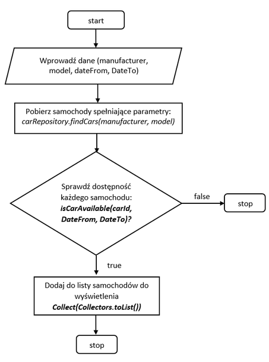
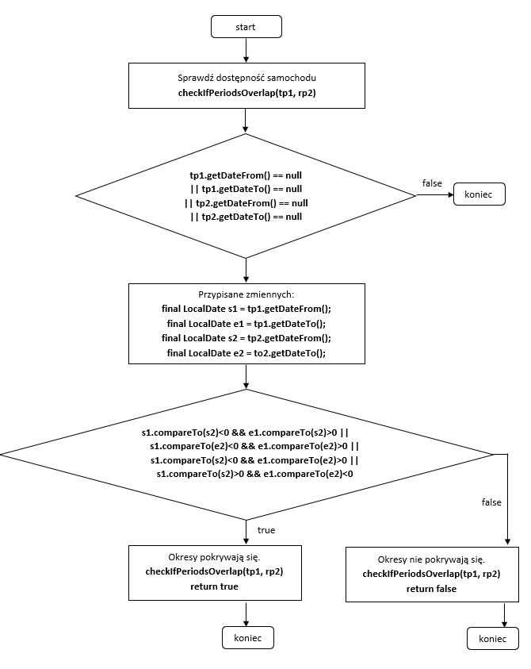

# 1. Repozytorium

## 1.1. Wymagania wstępne
Aby skorzystac z repozorium należy zainstalować na lokalnej maszynie aplikację aplikację do kontroli wersji.
Apikacja jest dostępna dla systemów Windows, Linux oraz MacOS:
https://git-scm.com/

## 1.2. Pobieranie repozytorium
Kod aplikacji znajduje się w repozytrium w serwisie GitHub:
https://github.com/lukaszse/car-rental

W celu pobrania repozytorium, użyj komendy:

`git clone https://github.com/lukaszse/car-rental.git`

## 1.3. Uruchamianie aplikacji
Aby uruchomić aplikację należy zbudować plik jak. W tym celu nalezy uruchomić komendę:

`./mvnw clean install`

## 1.4. Konfiguracja
W aplikacji skonfigurowano dwa profile **LOCAL** służący do uruchamiania aplikacji nalokalnym komuterze (z rszszerzonymi opcjami logowania, debbugowania oraz dostępem bez szyfrowania TSL) oraz **PROD** służący do uruchomienia aplikacji produkcyjnej na serwerze.
Profil można przełączyć poprzez modufykację zmiennej `spring.profiles.active=prod` która znajduję się w pliku `src/main/resources/application.properties`.
Szczegółowe konfiguracje dla środowisk znajdują się w plikach `application-local.yml` oraz application-prod.yml` znajdujących się w tej samej lokalizacji.

# 2. Obraz Docker
W głównym folderze aplikacji znajduje się plik `Dockerfile` który służy do zbudowania obrazu z aktualnego pliku jar znajdującego się w foldwrze `target`.
Aby zbudowac obraz nalezy użyć komendy:

`docker build -t nazwaObrazu .`

W celu zapisania obrazu w repozytorium zdalnym Dockera, tak aby był dostępny online dla innych maszyn należy użyć komendy:
`docker push nazwaObrazu`

# 3. Implementacja
## 3.1. Zastosowane technologie i wymahgania wobec developera
Aplikację napisano w języku Java w wersji 17 oraz z wykorzystaniem framerowka Spring Boot. W aplikacji wykorzystano także mechanizm szablonów Thymeleaf oraz elementy napisane w języku JavaScript.
Podstawowa znajomość wszystkich tych technologii jest konieczna do rozpoczęcia pracy z kodem aplikacji.

## 3.2. Wykorzystane algorytmy

### 3.2.1. Algorytm sprawdzania dostępności samochodu w danym przedziale czasu


#### 3.2.1.1. Opis algorytmu i kontekst jego zastosowania
W aplikacji zastosowano mechanizm sprawdzania dostępności samochodu w danym przedziale czasu.
Algorytm ten wykorzystywany jest w dwóch sytuacjach:
1. Wyszykiwanie samochodów w widoku **cars** - użytkownik ma możliwoś wpisania zakresu czasu (`dateFrom` oraz `dateTo`), w celu wyszukiwania dostępnych do wypożyczenia samochodów. Mechanizm ten realizowany jest z wykorzystaniem zapytania REST API **@GET** które zaimplementowane z wykorzystaniem Javascript.
   Do obsługi zapytania **@GEY** stworzon endpoint `cars/findCars` który przyjmuje m.in. dwa parametry QueryParam - dateFrom oraz DateTo.



3. Rezerwowanie samochodu (dodawanie rezerwacji) - po wyszukaniu samochodu użytkownim w widoku **cars** ma możliwość zarezrwowania wybranego samochodu po przez kliknięcie przycisku **Book**, a następnie po przez potwierdzenie zamówienia po przez kliknięcie przycisku **Submit** na ekranie z z danymi samochodu, co spowoduje wysłanie zapytania **@POST** oraz wywołanie metody 'performAddReservation' która przyjmuje kilka paramerów w tym parametry `dateFrom` oraz `dateTo`.
   Przed zarezerwowaniem samochodu również sprawdzana jest dostępność samochodu, a operacja przeprowadzana jest w formie transakcji.


Obie wyżej wymienione metody korzystają z klasy `AvailabilityService` oraz zaimlementowanego w niej algorytmu:

```java
    public boolean isCarAvailable(final Integer carId, final TimePeriod timePeriod) {
        if(timePeriod.getDateFrom() == null && timePeriod.getDateTo() == null) {
            return true;
        }
        return reservationSearchRepository.findByCar_Id(carId).stream()
                .map(reservation -> TimePeriod.of(reservation.getDateFrom(), reservation.getDateTo()))
                .noneMatch(reservationPeriod -> checkIfPeriodOverlap(timePeriod, reservationPeriod));
    }

    private static boolean checkIfPeriodOverlap(final TimePeriod timePeriod1, TimePeriod timePeriod2) {
        final LocalDate s1 = timePeriod1.getDateFrom();
        final LocalDate e1 = timePeriod1.getDateTo();
        final LocalDate s2 = timePeriod2.getDateFrom();
        final LocalDate e2 = timePeriod2.getDateTo();

        if(s1 == null || e1 == null || s2 == null || e2 == null) {
            return false;
        }

        if(s1.compareTo(s2)<0 && e1.compareTo(s2)>0 ||
                s1.compareTo(e2)<0 && e1.compareTo(e2)>0 ||
                s1.compareTo(s2)<0 && e1.compareTo(e2)>0 ||
                s1.compareTo(s2)>0 && e1.compareTo(e2)<0 )
        {
            log.info("Periods overlap! Period 1: {}, Period2: {}", timePeriod1, timePeriod2);
            return true;
        }
        else {
            return false;
        }
    }

```

Jak jak widać (co wynika z powyższego kodu) metoda `isCarAvailable` wywołuje zapytanie bazy danych z wykorzystaniem `RepositorySearchService` w celu pobrania wszystkich rezerwacji dla danego samochodu, a następnie sprawdza czy jakikolwiek okres z pobranych rezerwacji nie pokrywa się z okresem rezerwacji wymaganym przez użytkownika.
Jeśli żaden z tych okresów się nie pokrywa `noneMatch` metoda zwraca `true`, w przeciwnym razie `false`.
Samo sprawdzenie czy pojedynczy pobrany z bazy danych okres rezerwacji pokrywa się z okresem rezerwacji wymaganym przez użytkownika sprawdzane jest w metodzie 'checkIfPeriodOverlap'.
Niniejszy algortm przedstawiono na poniższych schematach blokowych (zastsosowano osobny schemat dla  metody `checkIfPeriodsOverlap`):



