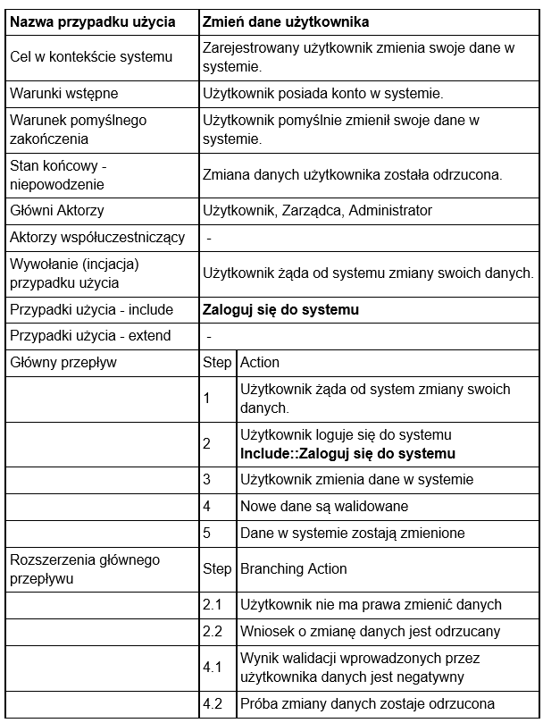
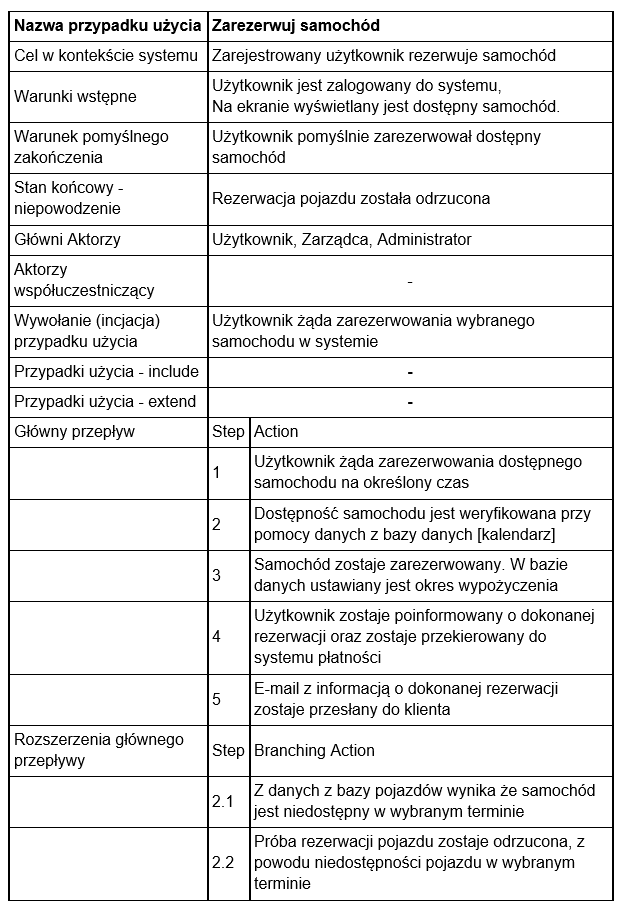
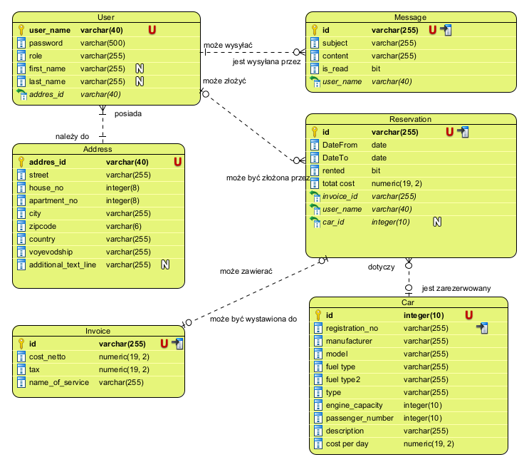
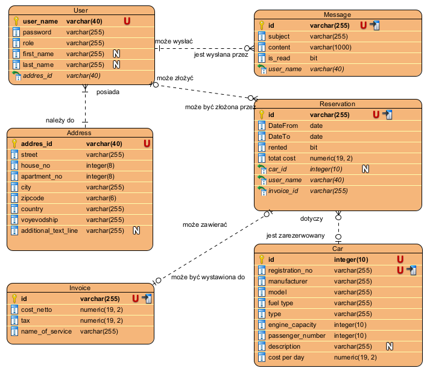
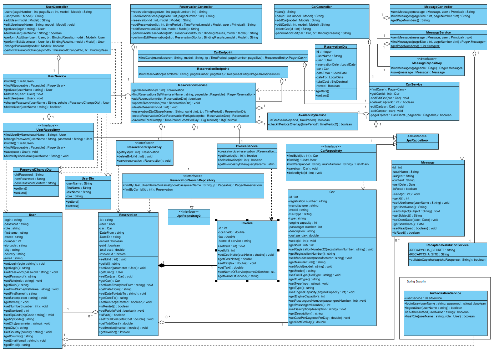
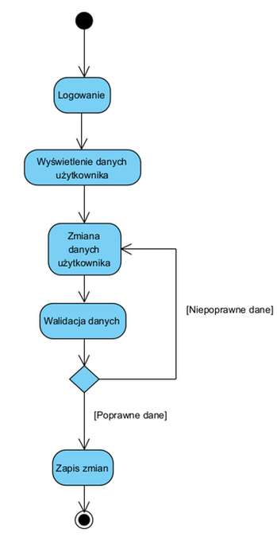
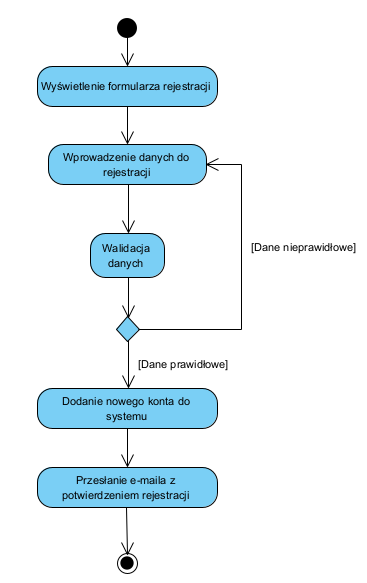
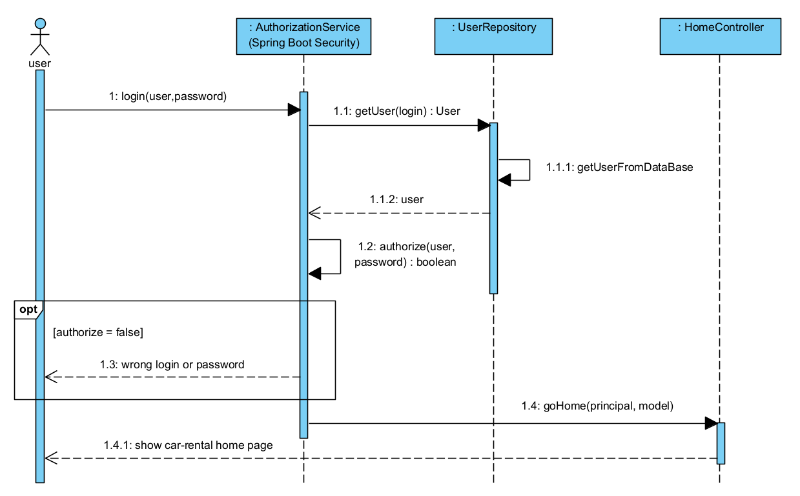
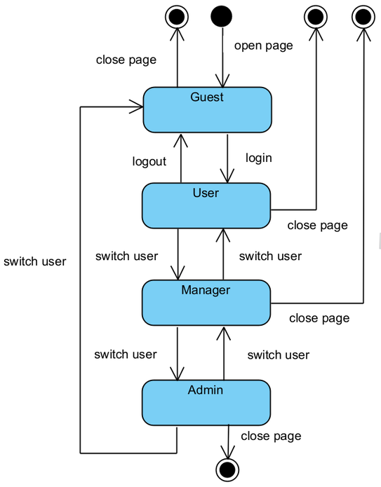

# 1. Cel projektu
Celem projektu jest zaprojektowanie oraz implementacja aplikacji webowej wspomagającej procesy obsługi zleceń związanych z wypożyczaniem samochodów osobowych dla klientów indywidualnych.
Po przez informatyzację wszystkich procesów obsługi klienta, aplikacja zapewni szereg korzyści m.in:
* redukcję kosztów obsługi zamówień po przez ich całkowitą automatyzację,
* zwiększenie wydajności obsługi klientów,
* zapewnienie bezpieczeństwa danych przechowywanych w scentralizowanej bazie danych.

# 2. Szczegółowy opis wymagań
## 2.1. Wymagania funkcjonalne
System umożliwia:
* wyszukiwanie dostępnych w określonym terminie samochodów, wg zadanych kryteriów takich jak:
    * marka,
    * model
* wyświetlenie szczegółowych informacji na temat wybranego pojazdu,
* rejestrację użytkowników,
* logowanie użytkowników
* zarządzanie użtrkownikami w trybie adminstratora (dodawanie/edycja/usuwanie)
* przeglądanie pojazdów w trybie gościa,
* dokonanie rezerwacji przez zarejestrowanego i zalogowanego użytkownika,
* odwołanie rezerwacji przez osobę zarządzającą,
* rejestrację użytkowników oraz modyfikację danych przez użytkowników,
* przeglądanie własnych rezerwacji,
* dodawanie/usuwanie oraz modyfikacje pojazdów przez osobę zarządzającą,
* przeglądanie listy zarezerwowanych oraz wypożyczonych samochodów przez osobę zarządzającą,
* obsługę płatności,
* generowanie i pobieranie potwierdzenia rezerwacji w formacie pdf
* kontaktowanie się z obsługą wypożyczalni po przez formularz kontaktowy
* wysyłanie wiadomości do obsługi serwisu
* wysyłanie wiadomości do obsługi w trybie gościa zabezpieczone reCaptcha v2
* walidacja dla wszystkich wprowadzonych pól wraz z systemem alertów/ostrzeżeń o źle wprowadzonych danych (pola o szczególnej składni jak kod pocztowy czy email walidowane z wykorzystaniem wyrażeń regularnych)
* zabezpieczenie ścieżek URL (dostęp do ściezki tylko dla użytkowników uprawnionych)

## 2.2. Opcjonalne wymagania funkcjonalne
* rozszerzenie wyszukiwania dostępnych samochodów o kryteria takie jak:
    * rodzaj skrzyni biegów
    * rodzaj silnika (benzyna/diesel/elektryczny)
* zmiana statusu z rezerwacji na wypożyczenie
* generowanie faktur dla rezerwacji
* generowanie korekty faktury w przypadku odwołania zlecenia

# 2.3. Wymaganie niefunkcjonalne
* GUI:
    * Aplikacja webowa z interfejsem dla przeglądarki internetowej
    * Spójny wygląd zgodnie z zaakceptowanym szablonem (spójna kolorystyka, menu, zachowanie się systemu)
* Dostępność:
    * Obsługa języków: polski
    * Obsługa przeglądarek: Chrome, Safari, Edge
* Niezawodność:
    * System dostępny 24/7. MTFB = 1000h.
* Bezpieczeństwo
    * haszowanie haseł
    * automatyczne wylogowanie użytkownika po upływie 10 minut
    * spełnia wymagania Ustawy z dnia 10 maja 2018 r. o
      ochronie danych osobowych (RODO)
* Tabele danych do wyświetlenia, w szczególności dla danych filtrowanych łaodwane bez przeładowywania całej strony. Architektura typu Single Page Application nie jest wymagana, dopuszczalna jest architektura hybrydowa.

# 2.4. Ograniczenia
* System musi być instalowany z obrazu Dockera pobieranego online
* Aplikacja zbudowana w oparciu o architekturę monolityczną we frameworku Spring Boot oraz wzorzez MVC
* System musi być zgodny z ustawą o ochdonie danych osobowych RODO

# 3. Użytkownicy (Role)
1. Administrator (super user)
  - posiada uprawnienia wszystkich użytkowników, a ponadto ma możliwość zarządzania użytkownikami oraz przypisywania użytkownikom okreslonej roli
2. Zarządzający
  - posiada uprawnienia użytkownika oraz gościa a ponadto:
    - posiada możliwość przeglądania wszystkich rezerwacji
    - posiada możlwiwość anulowania dowolnej rezerwacji
    - posiada możliwość modyfikacji dowolnej rezerwacji
3. Użytkownik
  - posiada uprawnienia gościa, a ponadto:
    - posiada możliwość dokonywania rezerwacji
    - posiada możliwość opłacania rezerwacji
    - posiada możliwość przeglądania swoich rezerwacji
    - posiada możliwość generowania faktur
4. Gość
  - posiada możliwość wyszykiwania pojazdów w wybranym terminie, spełniających wybrane kryteria.

# 4. Słownik pojęć

* **MTFB (Mean Time between Failures)** - średni czas pomiędzy wystąpieniem awarii
* **Docker** - otwarte oprogramowanie do wirtualizacji, umożliwiające "konteneryzację" tj. pozwalające umieścić program oraz jego zależności (biblioteki) w przenośnym wirtualnym kontenerze który można uruchomić na dowolnym serwerze z systemem Linux, Windows i MacOS.
* **GUI (Graphical User Interface)** - graficzny interfejs .
* **RODO** - Ogólne rozporządzenie o ochronie danych, inaczej rozporządzenie o ochronie danych osobowych, OROD lub RODO – rozporządzenie unijne, zawierające przepisy o ochronie osób fizycznych w związku z przetwarzaniem danych osobowych oraz przepisy o swobodnym przepływie danych osobowych.
* **PDF (PDF Portable Document Format)** - format plików służący do prezentacji, przenoszenia i drukowania treści tekstowo-graficznych, stworzony przez firmę Adobe Systems. Obecnie rozwijany i utrzymywany przez Międzynarodową Organizację Normalizacyjną. 
* **Spring Boot** - framework do budowania aplikacji w tym aplikacji webowych w języku java.
* **Thymeleaf** - silnik szablonów html.
* **H2** - baza danych SQL przechowująca dane w pliku lub w pamięci operacyjnej, stosowana do testów lub prostych aplikacji w tym MVP.

5. Diagramy przypadków użycia (wybrane przykłady)

.

6. Scenariusze przypadków użycia!

.

.

.

# 4. Model bady danych
## 4.1. Model logiczny (ERD)

# 4.2. Model relacyjny

# 4. Diagram klas

# 5. Diagramy czynności (wybrane przykłady)

## 5.1. Logowanie do systemu

## 5.2. Zmień dane użytkownika

## 5.3. Zmiana danych pojazdu

## 5.4 Wyszukiwanie samochodów

## 5.5. Rejestracja użytkownika

# 6. Diagramy sekwencji (wybrane przykłady)

## 6.1. Logowanie do systemu

## 6.2. Wyświetlanie listy wszystkich rezerwacji użytkownika

## 6.3. Wyświetlanie listy dostępnych samochodów spełniających wybrane kryteria

# 7. Diagramy stanów (wybrane przykłady)
## 7.1. Zarządzanie użytkownikami 

## 7.2. Status/rola zalogowanego użytkownika

## 7.3. Zarządzanie wiadomościami
